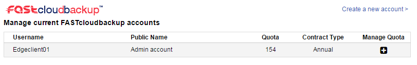

# Managing your FASTcloudbackup account

This section describes various admin tasks you may need to undertake from time to time.

## Creating additional FASTcloudbackup end user accounts

You will need to create at least one FASTcloudbackup end user account to start using the service.  If you wish to create additional accounts, go to the FASTcloudbackup page in [MyUKFast](https://www.ukfast.co.uk/myukfast.html) and click `Create a new account`.  See [Getting started](link) for more help.

## Changing storage quota

You can increase or decrease the storage quota attached to your FASTcloudbackup end user accounts at any time.  If you are planning to decrease your storage quota, please check the amount of data you currently have backed up first.  If you reduce your quota to less than the amount of data you currently have backed up, then no further backups will be able to run.

To change your storage quota go to the FASTcloudbackup page [MyUKFast](https://www.ukfast.co.uk/myukfast.html) and click `+` in the Manage Quota column for the account in question.  

You can then change the storage quota for the account.  Note that billing changes will take effect on your next bill.

## Changing password 

## Viewing login history

