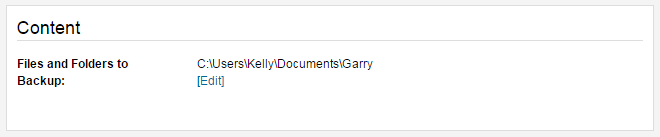
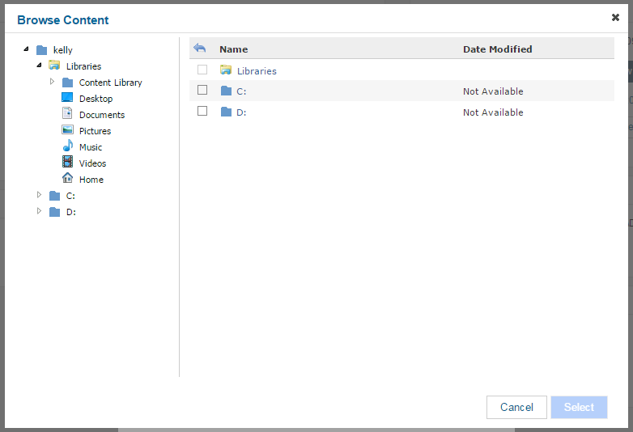

# Setting up backups

## Choosing which files and folders to back up

From the home screen of the web console click on `My Data`, find the computer or server you wish to work on and then click `Settings`.

By default, everything in your C:\Documents folder will be backed up.  If you wish to change which files and folders are backed up, go to the Content area on the right hand side and click `Edit`.

You can choose which files and folders to include in your backup process, or alternatively which ones you wish to exclude.  Click on the `+` symbol to specify which files and folders to include or exclude. 

Then navigate through your file structure to choose files and folders.

You can return to the default setting (backing up everything in C:\Documents) by clicking `Reset to Default Content`.
