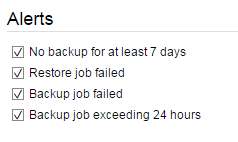

# Setting up alerts

You can set up a number of alerts to notify you of any problems with your backups.  You need to do this on each individual computer or server you are backing up.  From the homepage of the [FASTcloudbackup web console](https://fcb.ukfast.co.uk) click on `My Data` and then `Settings` for the computer/server you want to set up alerts for.

You will see the Alerts area on the right hand side of the screen.

There are four alerts you can choose to set up, by ticking the relevant box:

- No backup for at least 7 days
- Restore job failed
- Backup job failed
- Backup job exceeding 24 hours

Each alert will be sent as an email to your registered email address in the event of a problem.
