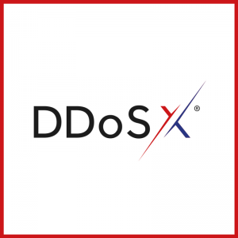

# Additional Services

## DDoSX® Protection

UKFast's flagship DDoSX service is a cloud-based offering that helps protect a website or web-based application by monitoring traffic between an end user and the application. The primary function is to protect websites from DDoS attacks by proxying all requests to the domain and automatically filtering them before it hits their firewall.



For the latest information on DDoSX® Protection please see [https://my.ukfast.co.uk/ddosx/](https://my.ukfast.co.uk/ddosx/) and [https://docs.ukfast.co.uk/security/ddos/](https://docs.ukfast.co.uk/security/ddos/) for all technical documentation.

## ThreatVision
UKFast's innovative ThreatVision product is our tailored, all in one HIDS/SIEM (Host-based Intrusion Detection System/​Security Information and Event Management) system that enables you to continually monitor for malicious activity on your solution.


For the latest information on ThreatVision please see [https://my.ukfast.co.uk/threat-vision/](https://my.ukfast.co.uk/threat-vision/) and [https://docs.ukfast.co.uk/security/threatmonitoring/](https://docs.ukfast.co.uk/security/threatmonitoring/) for all technical documentation.

```eval_rst
  .. title:: UKFast additional services build documentation
  .. meta::
      :title: UKFast additional services build documentation | UKFast Documentation
      :description: Build documentation for UKFast additional services
      :keywords: ukfast, hosting, service, server, virtual
```
