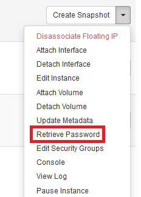

# Retrieving passwords for eCloud Flex instances

The public-key-encrypted instance password can be retrieved and decrypted (when available) using the corresponding private-key, useful for decrypting the `Administrator` password within Windows instances. The methods for doing so are outlined here. To access your Linux server, please follow the steps to [Access Linux eCloud Flex Instances Using SSH]((/operatingsystems/linux/ssh/keys.html#generating-keys). 

## Nova

The Nova CLI can be used to retrieve the password as below:

```console
[root@workstation ~]# nova get-password ba7a6424-3674-4f43-aca0-97dae8c23ef5 ~/private.key
Enter pass phrase for /root/private.key:
GDrtWKpcKHTQFUux3gpv
```

## eCloud Flex Dashboard

The [eCloud Flex dashboard](https://api.openstack.ecloud.co.uk/project) can be used to retrieve passwords.  Head to the Instances area, then click on the instance in question.  In the drop down menu at the top right of the screen you'll find the option to Retrieve Password.


