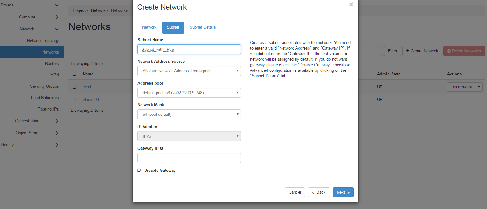

# Retrieving passwords for Flex instances

The public-key-encrypted instance password can be retrieved and decrypted (when available) using the corresponding private-key, useful for decrypting the `Administrator` password within Windows instances. The methods for doing so are outlined here.

## Nova

The Nova CLI can be used to retrieve the password as below:

```console
[root@workstation ~]# nova get-password ba7a6424-3674-4f43-aca0-97dae8c23ef5 ~/private.key
Enter pass phrase for /root/private.key:
GDrtWKpcKHTQFUux3gpv
```

## Flex Dashboard

The Flex instances dashboard can be used to retrieve the password via the available actions as below:


