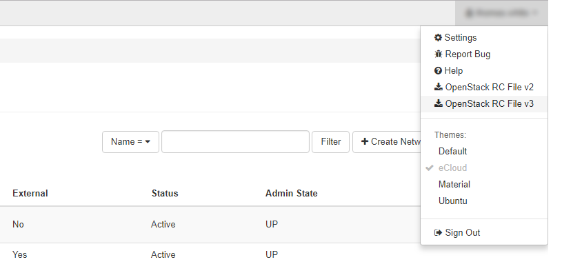

# Creating a Load Balancer with HTTPS Terminated Listener

To set up HTTPS termination on your eCloud Flex load balancer you will need to use the Command Line Interface of the [Neutron](https://docs.openstack.org/neutron/latest/) and [Barbican](https://docs.openstack.org/barbican/latest/) clients, as this functionality is not yet available through the eCloud Flex dashboard.

## Environment Configuration

If you don't already have an eCloud Flex load balancer set up that you wish to add HTTPS termination to, please follow the [guide here](/cloud/flex/lbaas/config_lb_through_interface.html) to create one.  You'll then need to install these Python packages, we recommend using `pip` with the command below:

`pip install python-neutronclient python-barbicanclient`

If you encounter difficulties in installing these clients, please ensure you are using the latest version of pip and have `python-devel` and `gcc` installed.

With these clients installed, next you need to set the correct authentication information as an environment variable. These can be easily set using the script available within your [eCloud Flex dashboard](https://api.openstack.ecloud.co.uk). In the top right corner of the screen, click the drop-down menu next to your username and select `OpenStack RC File v3`.



Download this file to your Linux filesystem and provide the file with execution capabilities using `chmod +x Project-[your-project-number]-openrc.sh`. Don't forget to enter your own eCloud Flex project number where indicated - again this is available in the eCloud Flex dashboard.

Now run the file with `source Project-[your-project-number]-openrc.sh`, and you will be prompted for your eCloud Flex password. Once done, you will have loaded in the details to your environment variables to authenticate with the Neutron and Barbican API endpoints.

## Upload the SSL Certificate to Barbican

Next you need to upload an SSL certificate to the secret store known as Barbican. If you do not have an SSL certificate, these can be purchased through [MyUKFast](https://www.ukfast.co.uk/sslcertificate.html).  Your certificate should be formatted according to the [X509 Standard](https://tools.ietf.org/html/rfc5280) with the website certificate at the top of the file, and the appropriate Certificate Authority bundle below it. If you have purchased your certificate from UKFast and have difficulty with this process, please contact our Support team by raising a ticket in [MyUKFast](https://my.ukfast.co.uk/pss/add.php) who can assist with this. 

For our example below, *certificate.crt* is our combined certificate, and *private.key* is the private key of the certificate.

To upload the certificate, use the following command replacing certificate.crt with your own certificate file name:

```bash
barbican secret store --payload-content-type='text/plain' --name='certificate' --payload="$(cat certificate.crt)"
```

The output of this command will look like the below. Please note down the `Secret href`, as you will need this shortly.

```
+---------------+-----------------------------------------------------------------------------------------+
| Field         | Value                                                                                   |
+---------------+-----------------------------------------------------------------------------------------+
| Secret href   | https://api.openstack.ecloud.co.uk:9311/v1/secrets/17cab2a5-98d2-4f50-a4cd-374c6b1a8c56 |
| Name          | certificate                                                                             |
| Created       | None                                                                                    |
| Status        | None                                                                                    |
| Content types | {u'default': 'text/plain'}                                                              |
| Algorithm     | aes                                                                                     |
| Bit length    | 256                                                                                     |
| Secret type   | opaque                                                                                  |
| Mode          | cbc                                                                                     |
| Expiration    | None                                                                                    |
+---------------+-----------------------------------------------------------------------------------------+
```

You will also need to upload the private key of the certificate to Barbican. Following a similar command structure to the previous step, the command looks something like this (again replace private.key with your own file name):

```bash
barbican secret store --payload-content-type='text/plain' --name='private_key' --payload="$(cat private.key)"
```

Again note down the `Secret href` given. 

```
+---------------+-----------------------------------------------------------------------------------------+
| Field         | Value                                                                                   |
+---------------+-----------------------------------------------------------------------------------------+
| Secret href   | https://api.openstack.ecloud.co.uk:9311/v1/secrets/456392b3-345e-4c76-af2d-2b84d7cad6c9 |
| Name          | private_key                                                                             |
| Created       | None                                                                                    |
| Status        | None                                                                                    |
| Content types | {u'default': 'text/plain'}                                                              |
| Algorithm     | aes                                                                                     |
| Bit length    | 256                                                                                     |
| Secret type   | opaque                                                                                  |
| Mode          | cbc                                                                                     |
| Expiration    | None                                                                                    |
+---------------+-----------------------------------------------------------------------------------------+
```

With the `Secret href` for both the certificate and private key, a container to arrange these secrets must now be constructed. Using the following command, replace the URL in the `certificate` field with the Secret href for your certificate, and do the same for the URL of the `private key`.

```bash
barbican secret container create --name='ssl_certificate_container' --type='certificate' --secret="certificate=https://api.openstack.ecloud.co.uk:9311/v1/secrets/17cab2a5-98d2-4f50-a4cd-374c6b1a8c56" --secret="private_key=https://api.openstack.ecloud.co.uk:9311/v1/secrets/456392b3-345e-4c76-af2d-2b84d7cad6c9"
```

If this is successful, you will receive a final output from Barbican, providing a `Container href` as shown below.  Again note this down as you will need it to complete the process.

```
+----------------+--------------------------------------------------------------------------------------------+
| Field          | Value                                                                                      |
+----------------+--------------------------------------------------------------------------------------------+
| Container href | https://api.openstack.ecloud.co.uk:9311/v1/containers/1a1ddbab-d237-4273-9148-d5db025acd87 |
| Name           | tls_container                                                                              |
| Created        | None                                                                                       |
| Status         | ACTIVE                                                                                     |
| Type           | certificate                                                                                |
| Certificate    | https://api.openstack.ecloud.co.uk:9311/v1/secrets/17cab2a5-98d2-4f50-a4cd-374c6b1a8c56    |
| Intermediates  | None                                                                                       |
| Private Key    | https://api.openstack.ecloud.co.uk:9311/v1/secrets/456392b3-345e-4c76-af2d-2b84d7cad6c9    |
| PK Passphrase  | None                                                                                       |
| Consumers      | None                                                                                       |
+----------------+--------------------------------------------------------------------------------------------+
```

If any errors are encountered during this stage, it is likely due to the format of your SSL Certificate not conforming to the X509 standard.  Please contact UKFast Support for assistance.

## Create the HTTPS Terminated Listener

Using your `Container href` noted from the previous steps, you will now need to create a HTTPS Terminated Listener on your Load Balancer. If you do not already have a Load Balancer, you will need to [create one](/cloud/flex/lbaas/config_lb_through_interface.html) before proceeding.

Creating the HTTPS Terminated Listener will require you to substitute two parameters in the following command. 

- *--loadbalancer* is the ID of your load balancer, which is available in the [eCloud Flex dashboard](https://api.openstack.ecloud.co.uk/project/ngloadbalancersv2) or by typing `neutron lbaas-loadbalancer-list`. 
- *--default-tls-container-ref* is the `Container href` you noted down in the previous step.

```bash
neutron lbaas-listener-create --name https-terminated-lb-listener  --loadbalancer ba873541-7ed2-4b55-b3f8-9dc6ec3761cd --protocol TERMINATED_HTTPS --protocol-port 443 --default-tls-container-ref  https://api.openstack.ecloud.co.uk:9311/v1/containers/1a1ddbab-d237-4273-9148-d5db025acd87
```

With this completed successfully, you should now see a further output after **Created a new listener**. Also if you now browse to your [eCloud Flex dashboard](https://api.openstack.ecloud.co.uk/project/ngloadbalancersv2) and to the Load Balancer in question, a further listener should now be available to create a pool of members. Please note that the SSL certificates stored in this process will not be visible through the dashboard, however upon testing this you will find the certificate is successfully in use.

```eval_rst
.. meta::
    :title: Creating a Load Balancer with HTTPS Terminated Listener | UKFast Documentation
    :description: Detailed guidance on establishing HTTPS Termination using an eCloud Flex Load Balancer
    :keywords: ecloud, flex, load balancers, lbaas, listener, pools, member pool, ssl, tls, https termination, https
```
