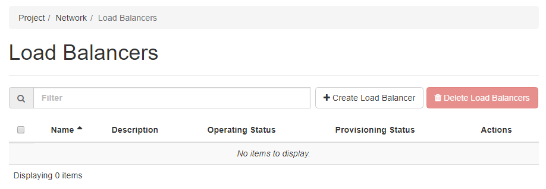
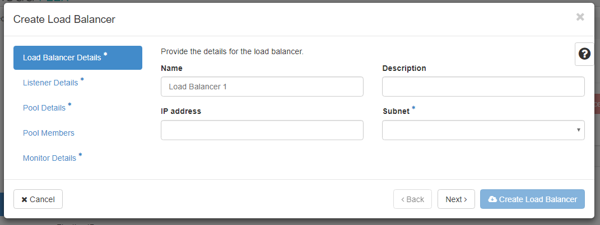
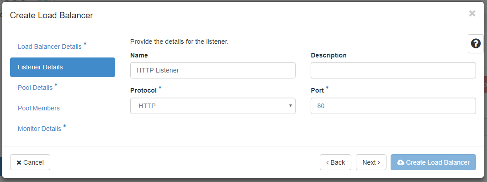
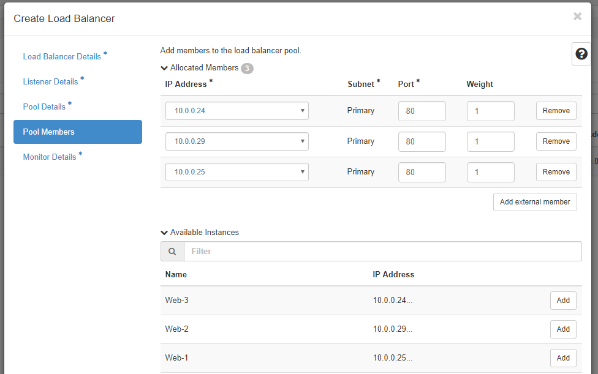
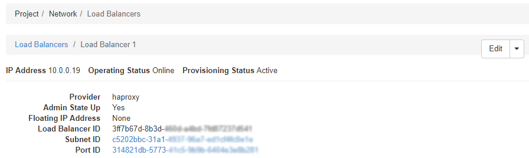
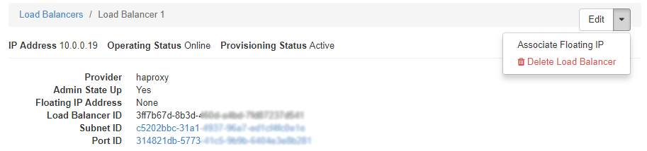

# Creating an eCloud Flex Load Balancer using the Horizon dashboard

## Creating a HTTP Load Balancer
Log in to the [eCloud Flex Horizon Dashboard](https://api.openstack.ecloud.co.uk/project/ngloadbalancersv2/) and navigate to the `Network` tab, then `Load Balancers` in the menu. If you have no existing Load Balancers, the table should be empty.

To proceed, click the `Create Load Balancer` button in the top right corner, you'll then see a pop-up as shown below.





Give your Load Balancer a name, an optional description, assign an IP address if you wish (one will be generated for you if the IP address field is left blank), and choose which subnet you would like the load balancer to be created on. Then click `Next`.

The next screen will prompt you for 'Listener' details. A Listener is the interface over which incoming traffic is received and distributed amongst the load-balanced pool of eCloud Flex instances (or 'members'). The screenshot below is an example of an incoming HTTP traffic listener.



You can also choose to configure listeners on **TCP** and **Terminated HTTPS** (HTTPS Offloading). More listeners can be added later in the process, and existing ones may be modified as required after setting the Load Balancer up for the first time.  If you want to use Terminated HTTPS on your Load Balancer you'll need to follow [this guide to create the relevant listener](/cloud/flex/lbaas/config_https_termination_cli.html).

Next is the Pool Details page, in which you must create your first 'member pool'. A member pool is the group of servers (instances) which will receive load-balanced traffic from the Listener you specified previously. You will need to give a name to the member pool, an optional description, and choose the load balancing method. The three load balancing methods available are:

-   **LEAST_CONNECTIONS** will always use the server with the least volume of existing connections from the load balancer. This may mean that between requests, clients may use different backends.
-   **ROUND_ROBIN** will use each backend in order and rotate between them on each request, regardless of the current volume of open connections to that backend or the client making the request.
-   **SOURCE_IP** is a way of ensuring clients connecting will always use the same backend between visits or requests so long as the source IP remains identical.

On the next screen you then add the pool members - the individual servers / instances which receive traffic from the listener. You can add instances to the pool from your list of Available Instances by clicking the `Add` button to the right of the instance.



For each instance, you can select the port and weight should you wish to shape traffic distribution between instances. The weight value may be set between 1 and 256. The greater the weight, the greater the share of traffic which will be directed to the instance.

The final step is the pool monitor, which determines which members of the pool are active and which are not. Instances which fail this health check are removed from the pool until they can pass the monitor check again. The three type of health monitor types are:

-   **HTTP** which will generate a HTTP request similar to that of a client visit. This method can monitor for the status code returned and the HTTP method used, as well as a URI to test
-   **PING** will generate an ICMP request to the server on the frequency set. This test is useful to determine if the server is online and responsive to network requests, but does not make any checks on the application layer
-   **TCP** performs a check on the port stipulated. For example, if a TCP health check on port 3306 is created, pool members will be suspended from the pool until a TCP handshake can successfully occur

To complete the process click `Create Load Balancer`.  The load balancer will be provisioned and appear in the dashboard shortly. If the `Create Load Balancer` button remains greyed out, please check you've completed all mandatory fields (identified with an asterisk) in the steps outlined above.

## Assocating a Floating IP with a Load Balancer

To enable IPv4 access to your Load Balancer from public networks, a Floating IP address must be added. To check if you have a Floating IP address already associated, and what that address is, open the [Load Balancer dashboard](https://api.openstack.ecloud.co.uk/project/ngloadbalancersv2/) and click on the Load Balancer you are investigating. On the next page, a **Floating IP Address** field will show the Floating IP attached to the Load Balancer if one is available, or show "None" if this has not yet set up.



Please note, the IP address displayed towards the top-left of the page is the internal IPv4 address of the Load Balancer, but this IP will not be publicly accessible by others outside of your eCloud Flex network.

To attach a Floating IP, use the drop-down menu next to `Edit` in the top right corner, and select `Associate Floating IP`.



Depending on your existing network configuration, one or two options may be provided. If two options are presented, the first will be **Floating IP Addresses** where you may directly select from the reserved Floating IPs in your account to attach to the Load Balancer. The other option will be **Floating IP Pools**. Selecting this option will tell your network IP pool to automatically reserve a floating IP address for your eCloud Flex account, and then continue to associated this address with your Load Balancer for you.

Regardless of which method is chosen to select a Floating IP address, clicking the `Associate` button will add this to the load balancer, and this should be usable immediately to connect to. 

```eval_rst
.. meta::
    :title: Creating an eCloud Flex Load Balancer using Horizon | UKFast Documentation
    :description: Detailed guidance on establishing a load balancing instance on eCloud Flex using the Horizon dashboard
    :keywords: ecloud, flex, load balancers, lbaas, listener, pools, member pool,
```
