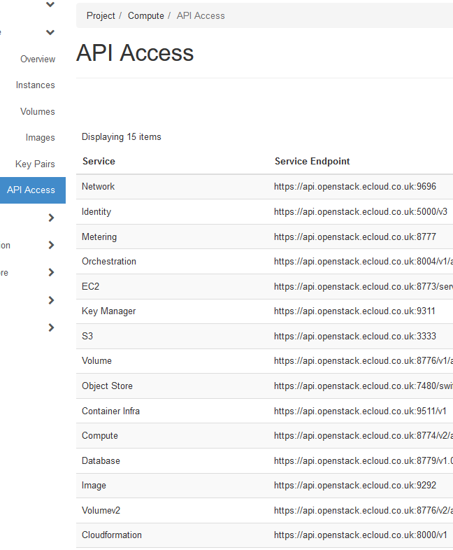

# OpenStack Documentation

There is a huge amount of OpenStack documentation available, below are links to some of the main areas you may find useful.

## Documentation for key OpenStack projects

- [Nova (Compute)](https://docs.openstack.org/nova/latest/)
- [Compute API](https://developer.openstack.org/api-guide/compute/)
- [Swift (Object Storage)](https://docs.openstack.org/swift/latest/)
- [Cinder (Block Storage)](https://docs.openstack.org/cinder/latest/)
- [Keystone (Identity service)](https://docs.openstack.org/keystone/latest/)
- [Glance (Image service)](https://docs.openstack.org/glance/pike/)
- [Heat (Orchestration)](https://docs.openstack.org/heat/pike/)

The full set of OpenStack documentation including SDKs, Installation Guides and User Guides can be found on the [docs.openstack website](https://docs.openstack.org/queens/).

```eval_rst
.. note::

   The links above will generally take you to documentation for the latest OpenStack release of each project.  This may not be the same as the version we're running at UKFast.

```
To identify the current API version your eCloud Flex solution is based upon, login to your [eCloud Flex dashboard](https://api.openstack.ecloud.co.uk/project/api_access/) and head to API Access in the left hand menu.  You'll see a list of service endpoints which will help identify the correct version in use, and hence which documentation you should refer to.




```eval_rst
.. meta::
     :title: OpenStack documentation | UKFast Documentation
     :description: Links to the main OpenStack documentation for running your eCloud Flex solution
     :keywords: openstack, ecloud, flex, ukfast, nova, swift, cinder, glance, keystone, heat, hosting, cloud, api
```
