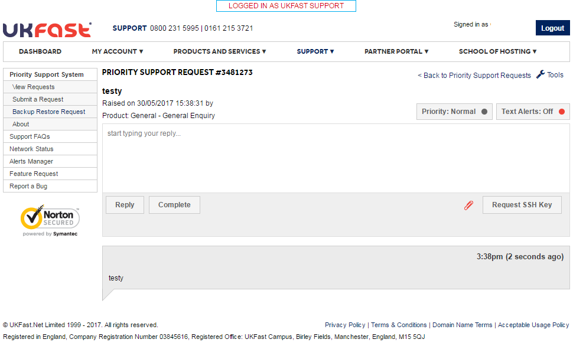

# UKFast support access to your eCloud Flex instances

If you've chosen UKFast support for your eCloud Flex project, then with your permission a UKFast Support Engineer will be able to login to your eCloud Flex instances to help troubleshoot and resolve problems.

To enable a UKFast support engineer to login to your instance, when you raise a support request via [MyUKFast](https://my.ukfast.co.uk/pss/add.php) you will need to request an SSH key and add this to your instance.

To do this, once you've raised the support request click on `Request SSH key`

If you've already requested an SSH key previously then you can retrieve it by clicking `Retrieve SSH key`

Once you have the SSH key, you will need to [follow this guide to add it to your eCloud Flex instance](/cloud/flex/support/sshkey.html) and grant access to `ukfastsupport`.

If you run into any problems on this, please mention it in your support ticket, or call UKFast support directly on 0800 230 0032.
