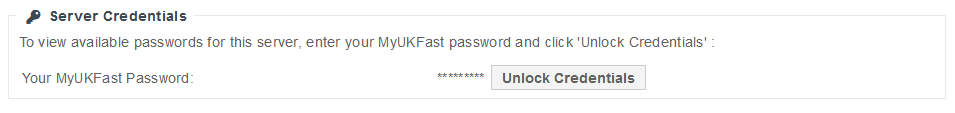

# eCloud Public VM credentials

Once launched you can find credentials to your eCloud public VM by selecting the VM from the list in [MyUKFast](https://my.ukfast.co.uk/ecloud-public). At the bottom of this page a section as shown below will be present.



After entering your MyUKFast password and selecting unlock credentials a list of all users UKFast has on record will be presented.

```eval_rst
.. meta::
   :title: eCloud Public APIs | UKFast Documentation
   :description: Programatic control of your eCloud Public resources
   :keywords: ukfast, cloud, ecloud, public, hosting, infrastructure, vmware, credentials, login, users
