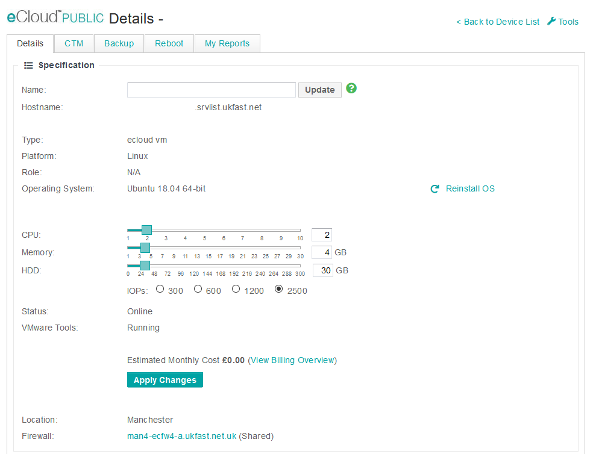
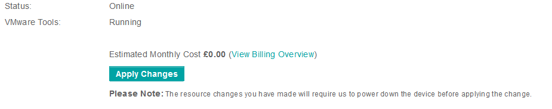

# eCloud Public Edit CPU

If resource contention on CPU is noticed and additional resource is required this can be easily scaled within [MyUKFast](https://my.ukfast.co.uk/ecloud-public) by selecting the VM in question which will open the below VM configuration page.



Within this screen you can drag the CPU slider to increase or decrease the CPU count allocated to this VM specifically. After this has been set you can then apply changes for this to take effect. This can be done while the VM stays online as we allow CPU hot-add on the platform. A reduction of CPU allocation however will require a reboot this is clearly stated before actioned as shown below.



```eval_rst
.. meta::
   :title: eCloud Public APIs | UKFast Documentation
   :description: Programatic control of your eCloud Public resources
   :keywords: ukfast, cloud, ecloud, public, hosting, infrastructure, vmware, CPU
