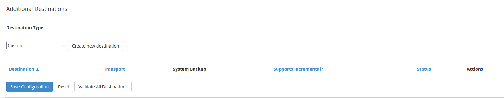

# Configuring cPanel Backups using the S3 Interface

[cPanel & WHM Release 74](https://documentation.cpanel.net/display/74Docs/74+Release+Notes#id-74ReleaseNotes-NewS3%E2%84%A2CompatibledestinationtypeinWHM'sBackupConfigurationinterface) brings various features to the panel, including the ability to backup your websites and configurations directly through an S3 interface. With eCloud Vault, you can configure your cPanel backups to send your data directly to your Vault. It's easy to configure, manages your backup retention for you, and saves disk space on your system.

## How to configure

1. From the WHM Dashboard, browse to `Home >> Backup >> Backup Configuration`.

2. Ensure that the backup switch is enabled, which will allow for backup activity.

Below this, you will see various backup configuration options, such as retention, scheduling, and database settings. At the bottom of the page, you'll see an `Additional Destinations` sub-heading.



3. Within the `Destination Type` drop down menu, select `S3 Compatible`, then choose `Create New Destination`.

4. You will fill out a series of options which tells cPanel where to send your backups... The configuration settings are as follows:

+----------+-------------+
| Setting  | Description |
+==========+=============+
| Destination Name | This name appears in your destination table in cPanel. |
+----------+-------------+
| Transfer System Backups to Destination |  Select this checkbox to transfer system backups to this additional destination (Warning: Only select this if you are using the Vault interface over HTTPS) |
+----------+-------------+
| Bucket                                 | Enter the name of the directory where you wish to store backups. |
+----------+-------------+
| Access Key ID                          | Enter the access key ID in this text box. Your server uses the access key to authenticate with the eCloud Vault account. This can be found within [MyUKFast](https://my.ukfast.co.uk/ecloud-vault/integration.php). |
+----------+-------------+
| Secret Access Key                      | Enter the secret access key in this text box. |
+----------+-------------+
| Timeout                                | The maximum amount of time, in seconds, that you want the server to wait for a response from the remote server before it generates errors. You must enter a number between 30 and 300. If the server does not respond before the time expires, it makes two additional attempts to contact the server. If the server does not respond after those attempts, the system administrator receives an email that notes the failed attempts. The system will retry the transfer when it runs the backup process again. |
+----------+-------------+
| S3 Endpoint                            | This is the S3 endpoint that you would like to connect to **(https://vault.ecloud.co.uk)** |
+----------+-------------+

5. Once these values have been filled with your unique access and secret keys, select 'Save and Validate Destination'. 

6. Ensure that you receive a success message:

>  "Success: The destination “Vault” validated."

Once you have validated connection to your Vault and tweaked your backup configuration options to your liking, you should be ready to go!

For more information about cPanel Backup features and configuration options, please refer to [their documentation](https://documentation.cpanel.net/display/74Docs/Backup+Configuration#BackupConfiguration-Overview).

For more information about eCloud Vault's features and pricing, please go to our [product page](https://www.ukfast.co.uk/ecloud-vault.html).

```eval_rst
.. meta::
   :title: Configuring cPanel backups with eCloud Vault | UKFast Documentation
   :description: How-to guide for configuring cPanel backups with s3 interface (eCloud Vault)
   :keywords: eCloud, Vault, eCloud Vault, cPanel, cPanel Backups, integration, s3 backups
```
