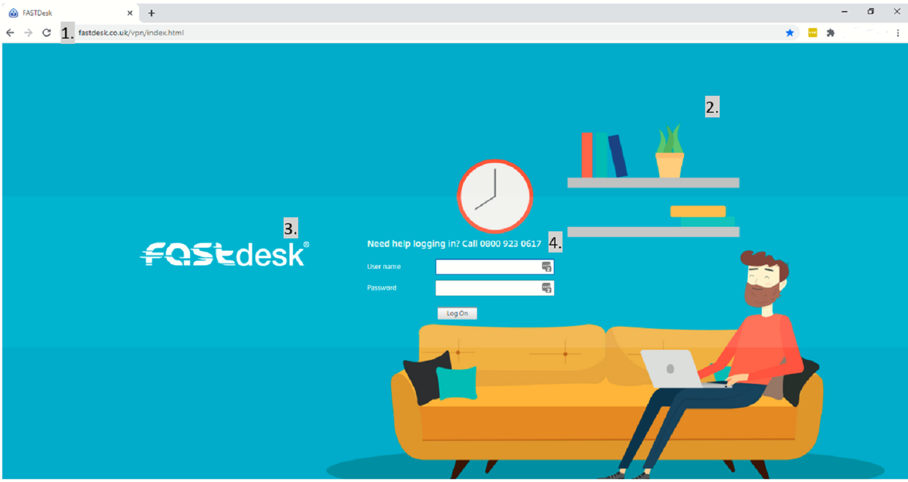
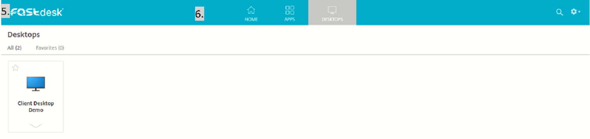

# Custom-Branding

**Custom-Branding** allows you to impress your clients with out-of-the-box, enterprise-level technology, branded from your own portfolio. Offer UKFast's Desktop-as-a-Service solution as your own, build your brand and expand your business offerings. **Custom-Branding** will enable you to customise your FastDesk environment without the cost of a Private FastDesk. You will be able to add your own branding to a custom domain.

## What can be Custom-Branded?



The image above identifies the four front-end aspects that can be custom branded when a user reaches the login page.

1. The domain name of the webpage that users access in order to login can be custom branded. Instead of logging in via the `"www.fastdesk.co.uk"` webpage, clients can use their own domain name. This domain can be anything of your choosing and it often relates to the company using the FastDesk environment. The most common domains used are `"desktop.companyname.co.uk"` or `"vdi.companyname.co.uk"`.
* Once the domain has been purchased, you will also need to buy an SSL for your new domain to ensure that that your FastDesk environment is secure. You can purchase SSLs from UKFast within your [MyUKFast Control Panel](https://my.ukfast.co.uk/login). Once logged in, you can use the navigation menu to find SSL certificates. From here, you can buy a certificate. The FastDesk team will require the SSL in a `.pfx` format alongside the password (This can be put in a ticket to us). This will then be implemented.
* Next, you need to configure the DNS for the domain. You can do this from your DNS zone which is where you purchased the domain. We will provide you with the IP Address to point the domain too. You will need to create an A record for this.

```eval_rst
.. note::

  You can purchase the domain from any reputable domain seller. However, please note that you will need access to control the DNS zone for the domain.

```

2. The background on the on login page can be custom branded. This can be changed to any background image you would like. UKFast require the dimension of the image that will be provided by the client to be `1920px x 1080px`.

3. The logo displayed on the login page can be custom branded. This can be changed to any logo you would like. UKFast require the dimension of the image that will be provided by the client to be `340px x 80px`.

4. The text and phone number displayed on the login page can also be custom branded. You may change this to a number which directly goes the person/team that would act as a first point of contact. To do this, we would simply require what you would like this text to be.

The image below identifies the three front-end aspects that can be custom branded once a user has logged in and reaches the Storefront.



5. The logo displayed on the Storefront can be custom branded. This can be changed to any logo you would like. Most clients make sure this logo matches the one on the login page. UKFast require image dimensions to be `340px x 80px`.

6. The colour of the banner displayed at the top of the Storefront page can also be custom branded. UKFast will require you to provide us with the hex value of the colour this needs to be.

7. Once inside FastDesk, the desktop background can be also be custom branded. UKFast require the dimension of the image that will be provided by the client to be `1920px x 1080px`.

```eval_rst
.. note::

  If you have any questions or still require assistance, please contact the FastDesk support team on 0800 923 0617.
```

```eval_rst
   .. title:: FastDesk | FastDesk Desktop Custom-Branding
   .. meta::
      :title: FastDesk Custom-Branding | UKFast Documentation
      :description: Guide on how to white label and custom brand the FastDesk desktop
      :keywords: FastDesk, Citrix, ukfast, VDI, Whitelabelling, Workspace Application, custom, branding, custom-branding, desktop
```
