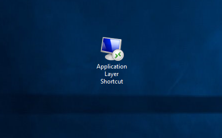
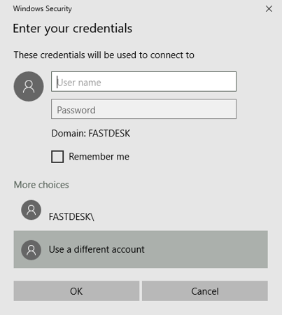
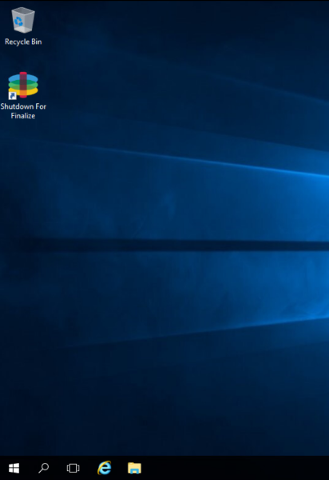

# How to log into the Database

If you have purchased any additional virtual vachines (VMs) from UKFast(Database Server, Application Server, File Server), you will be provided with an additional user which is called `Database user`. This user is a regular FastDesk user with elevated permissions that allows it to connect to any additional VMs as well as the application layer (For more information on accessing the application layer, please visit our guide [link here](https://docs.ukfast.co.uk/desktop/fastdesk/applayerlogin.html) .


## Step 1 - Login as Database User

To access your additional VM, you will need to log into your database user, this is accessed the same way as you would access your desktop when you login. From the FastDesk login page, enter the credentials for the database user (which will have been provided to you through email or ticket when your database machine or entire solution was setup).


Once you are logged in, please open up the database user desktop as usual. 

Once the database user desktop has launched, you should see a remote desktop application (RDP) shortcut that has been created on the desktop. This will be called `"Application layer Shortcut"`. Alternatively, it may be called the name of the application you are looking to install. 



If you click on that shortcut you should be prompted to enter a password to login into the application layer. The password needed will be provided to yourself through the ticket system via a ticket that will be raised in regards to your application install or update. If additional information is needed such as a username or IP address of the application layer then they may also be provided in the ticket. Refer to **image 3** below.



## Step 3 - Installing or Updating the Application(s)

Once the application layer has been launched, you will see the `Recycle Bin` as well as a `Shutdown for Finalize` shortcut. You now have elevated admin privileges to install and/or update applications. Please install or update any applications that you have requested be added. Refer to **Image 4** below.



  ```eval_rst
.. warning::

   Please do not shut down or finalize the application layer. Doing this will make it inaccessible and will require us to open a new application layer for yourself.
   
```

Once complete, please sign out of the application layer.  For more information on how to do this, please visit our guide on how to properly sign out of your desktop [link here](https://docs.ukfast.co.uk/desktop/fastdesk/signout.html) 

Once signed out, please inform the FastDesk team that you are ready to push this layer out to users. If you are installing an application for the first time, please state which users you want to have access to the application.

To allow for the updated application to come through on your desktop yourself, and other users looking for the updated application layer will need to sign out of your desktop, wait a few minutes and then sign back in. After doing so the updated or newly installed application will appear on your desktop.
 


**_This instruction guide should assist you in installing or updating applications on an application layer. If you have any questions or still require assistance, please contact the FastDesk support team on 0800 923 0617_**.


 ```eval_rst
   .. meta::
      :title: Installing or Updating an Application | UKFast Documentation
      :description: Guide for users on how to install or update and application 
      :keywords: FastDesk, Citrix, VDI, Citrix Receiver, Windows, Workspace Application, Application Layer, Database, Installation, Updating, LOB, Line of Business

