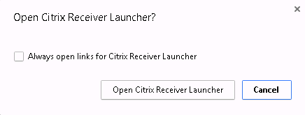
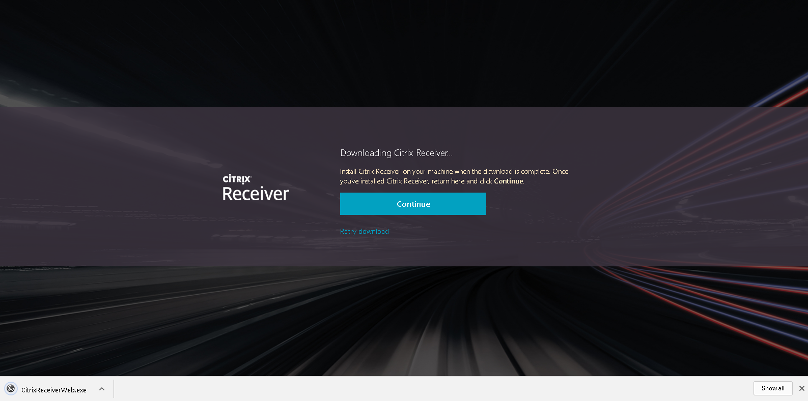
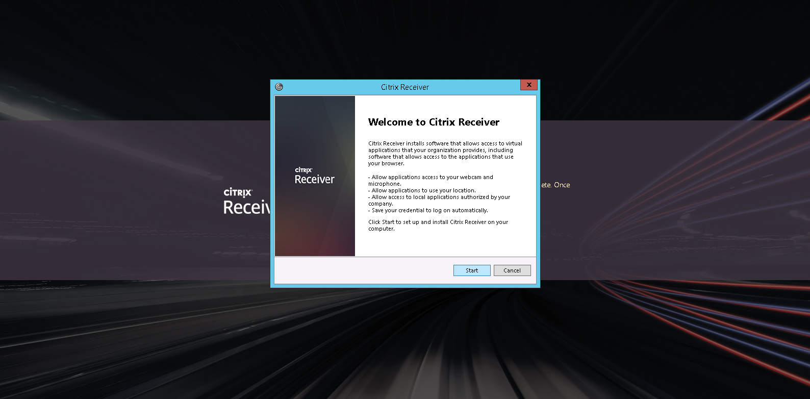
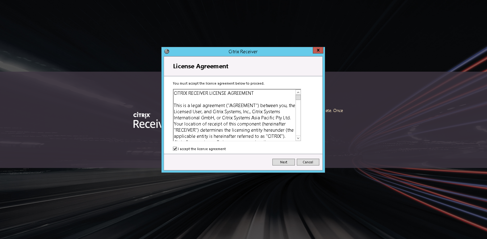
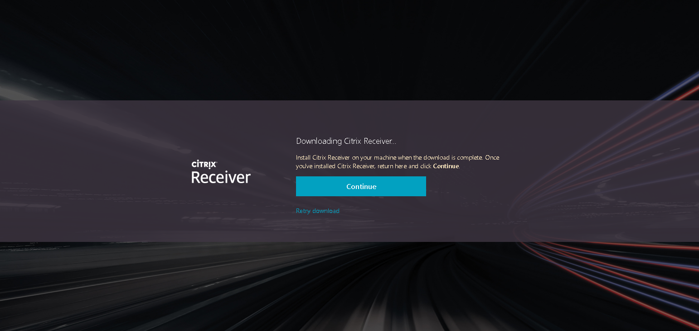
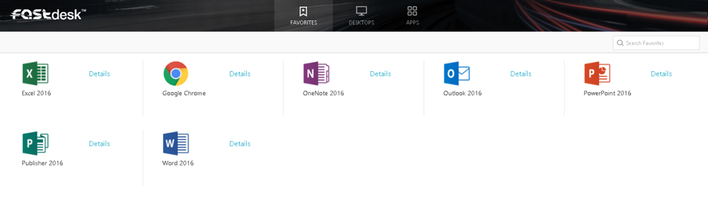
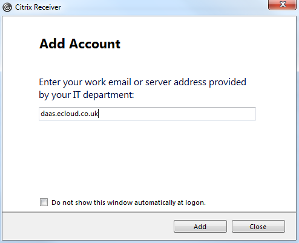
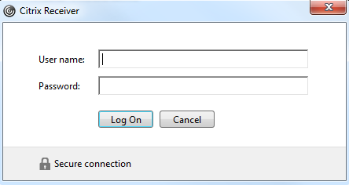
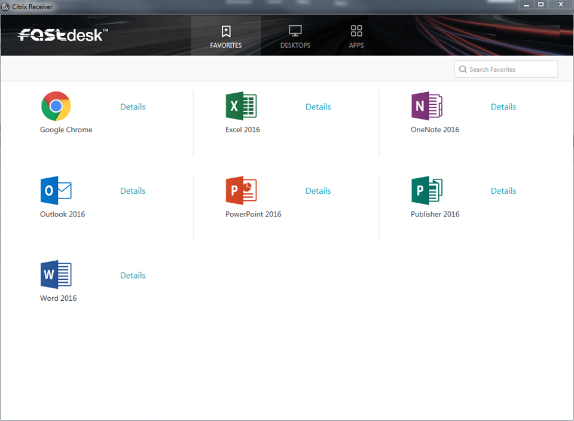

# Installing and Configuring Citrix Receiver

## Downloading Citrix Receiver

Navigate to the [FASTdesk web application](https://daas.ecloud.co.uk) and login using the credentials you have been given. Your username should be something like `yourname@companyname.fastdesk`


Once you've logged in, you will be prompted to change your password. For security purposes, passwords must be 8 characters or longer and include mixed case and at least one number.


Another screen will then appear. Here, click the __Detect Receiver__ button. This detects whether Citrix Receiver is already installed on your device.


If Citrix Receiver is already installed, you should see a notification appear similar to the below. Here, click __Open Citrix Receiver Launcher__.



However, if you don't have Citrix Receiver installed then you will need to install the application in order to proceed further. Read and agree to the Citrix license agreement and click the __Download__ button in order to this.

Once you have clicked __Download__, you will be able to see the progress of the file which is being downloaded in your browser. Once downloaded, left-click the download to start the install.



Installing Citrix Receiver is done in a few simple steps. You'll initially see the following screen:



If you're happy with what you have read above, click __Start__.

You'll then be asked to read through another license agreement. If you're happy with this, check the tick box and click __Next__.



You'll then see a screen asking if you wish to send anonymous data and usage statistics to Citrix. Feel free to check the __No, Thanks__ box if you wish.


Citrix Receiver will then begin to install.


Once Citrix Receiver has fully installed you'll see the following:


You should then be reverted back to the screen below:



Now that Citrix Receiver has been downloaded and installed, you can click __Continue__ here.

You may then see the following screen. As you can see below, a check is run to check that Citrix Receiver was installed correctly. If this is the case, you may see the __Citrix Receiver Launcher__ appear. Here, click __Open Citrix Receiver Launcher__.


You'll then be logged into FASTdesk and you'll be able to launch your applications.



## Configuring Citrix Receiver

As well as logging into FASTdesk via the web portal, you can also log in through Citrix Receiver directly. Once you've followed the steps to download Citrix Receiver above, launch Receiver on your local computer.


You'll then be asked to __Enter your work email or server address provided by your IT department:__



Here, you'll need to enter __daas.ecloud.co.uk__ and then click the __Add__ button.

You'll then be prompted to enter your FASTdesk login credentials.



Click log on, and if your credentials are correct, Citrix Receiver will then load and you'll be able to launch your applications.



```eval_rst
  .. meta::
     :title: Installing and Configuring Citrix Receiver | UKFast Documentation
     :description: A guide to installing and configuring Citrix Receiver
     :keywords: ukfast, fastdesk, install, citrix, receiver, configure, tutorial, desktop
