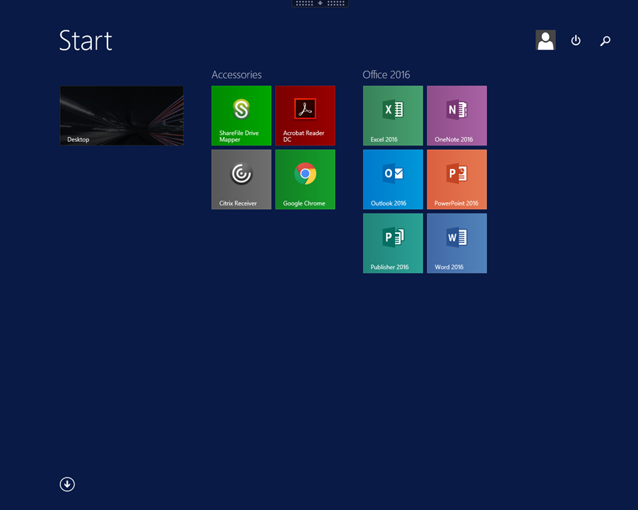
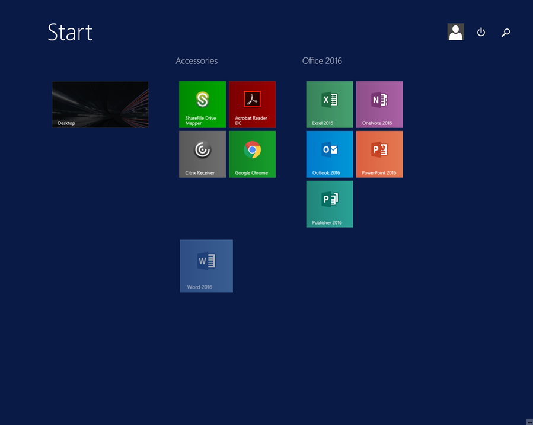
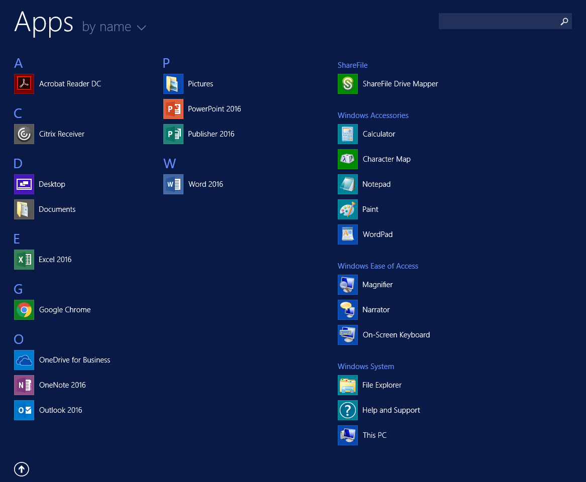

# How to navigate the start menu:

Upon first login, your start menu should look like the below.



By default, all Office applications and accessories such as Chrome and Acrobat Reader are grouped together. However, you do have the choice to change this to your liking.

Each of the above icons can be manoeuvred around using a drag and drop motion.



You can view the list of apps installed by hitting the down arrow in the bottom-left corner of your screen.


The full list of apps is listed below. This list includes the apps which are already pinned to the start menu or task bar.



If you right click an app you’ll see a variety of options appear. However the main two are __Pin to start__ (Unpin from Start) and __Pin to taskbar__ (Unpin from taskbar).


Pinning an app to your start menu means that it will appear on the initial start menu. In this instance I have pinned __Calculator__ to the start menu.


Pinning an app to the taskbar means that it will be seen at the bottom of your desktop. In this instance I have pinned __Notepad__ to the taskbar.


Applications can also be unpinned in exactly the same way. Just right click the application and you’ll see the options below.


```eval_rst
  .. meta::
     :title: Navigating the Start Menu | UKFast Documentation
     :description: A guide to navigating the Start Menu on FASTDesk
     :keywords: ukfast, fastdesk, start, menu, navigation, desktop, cloud, server, apps, taskbar
