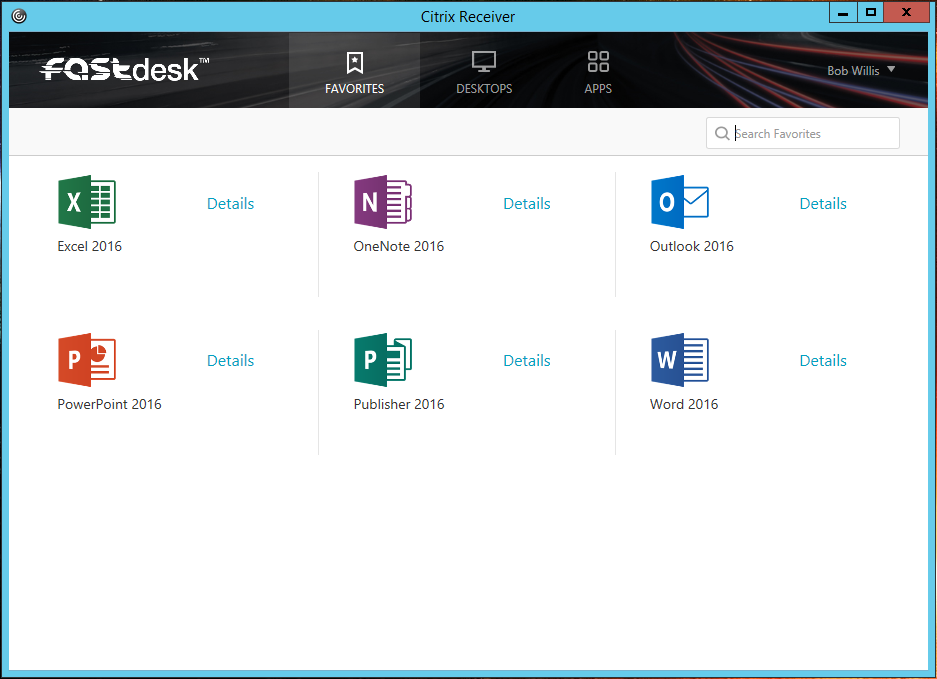
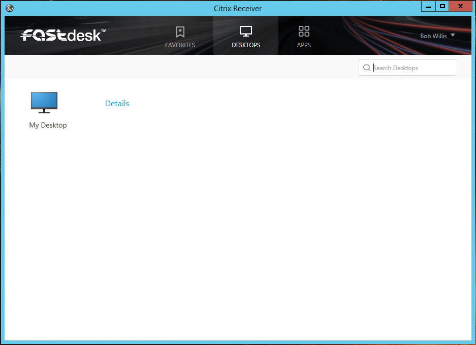
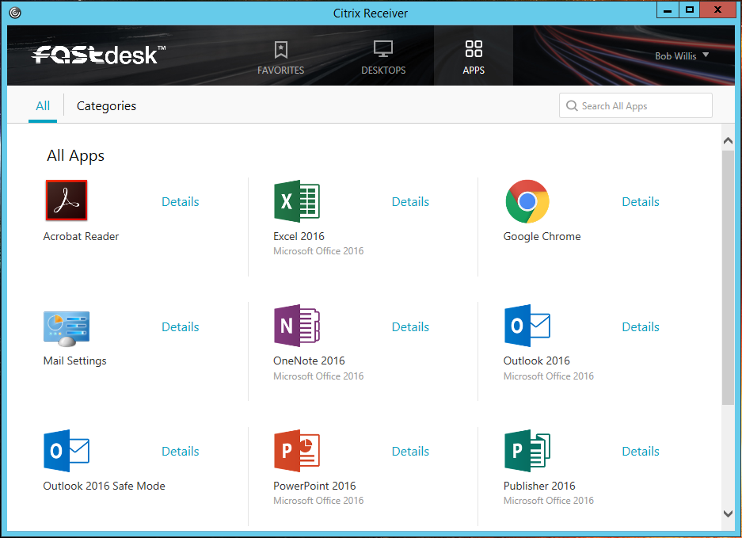
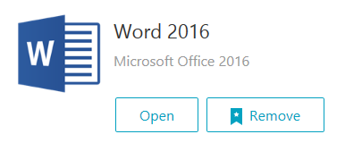

# Navigating the FASTdesk interface

## Finding your Applications and Desktops

When you first open FASTdesk, the default tab __FAVOURITES__ will open



You may also have a __DESKTOPS__ tab, if your solution has Desktops included



You can find your entire collection of applications in the __APPS__ tab



## Managing your Favourites

You can favourite an Application or Desktop by clicking the __Details__ link next to it and click the __Add To Favourites__ button


Similarly, you can remove an Application or Desktop from your Favourites by clicking __Details__ and click the __Remove__ button



```eval_rst
  .. meta::
     :title: Navigating the FASTdesk Interface | UKFast Documentation
     :description: A guide to navigating the FASTdesk interface
     :keywords: ukfast, fastdesk, navigating, apps, desktop, manage, cloud, hosting
