# Launch FastDesk on a Android Device

FastDesk® is UKFast’s Desktop as a Service (DaaS) solution, which allows users and organisations to work more effectively and securely by giving access to files, applications, and desktop items remotely via an internet connection. All desktop settings and files are stored remotely in the cloud, providing cross-device compatibility and eliminating the risk of data loss by removing the risk of unauthorised access. This DaaS solution allows users to work in the same way they would with a traditional local desktop, but increase the flexibility with which they do so regardless of the endpoint device hardware, operating system or form factor.

```eval_rst
.. note::

    Compatible with Nougat (Android 7.x), Oreo (Android 8.x), Pie (Android 9.x) and Android Q (Android 10.x). For the most optimum experience, we recommend updating your Android device to the latest Android Software.
   
```

## Pre-Installation information

This guide provides step by step instructions on installing and accessing FastDesk on your Android device through the Citrix Workspace application. It is possible to access FastDesk through the web portal on your Android device, however, it is recommended FastDesk is accessed specifically through the Citrix Workspace Application. The Citrix Workspace application gives you:

- Instant access to your FastDesk environment in an easy-to-use, all-in-one interface. 
- The Workspace application also fully integrated with the Citrix Content Collaboration (Also known as ShareFile) which gives you ability to upload and download files all within the one application. 

If you currently use the older Citrix Receiver for Android, Citrix Workspace will replace this. If your Android device has insufficient storage, it is possible to install the Citrix Workspace App for Android on an external SD card and mount it on the local device (For more information on this, please contact the FASTdesk Team).
 
## Step 1 - Installing the Citrix Workspace Application

To begin with, on your Android device, navigate to and open the Google Play store. Once complete, use the application search bar to look for “Citrix Workspace”. When found, please refer to **_image 1 included below_** to ensure it is the correct application. Once confirmed, proceed to install the application by tapping the green install button. 

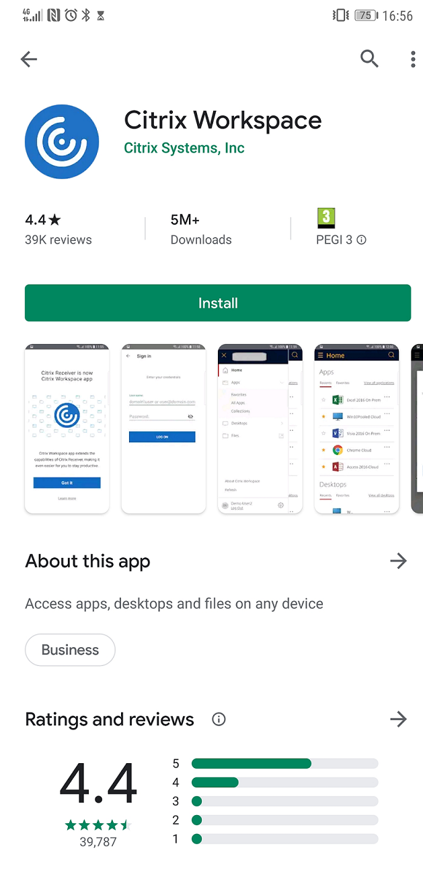

Once installation begins, your screen will be similar to what is pictured in **_image 2 below_**.

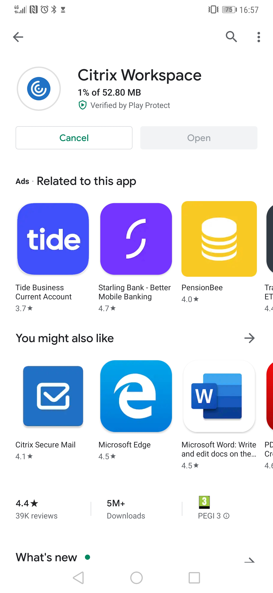

## Step 2 - Logging into the FastDesk Portal
Once the "Citrix Workspace" application is installed, proceed to open it (Refer to **_image 3_ below**).

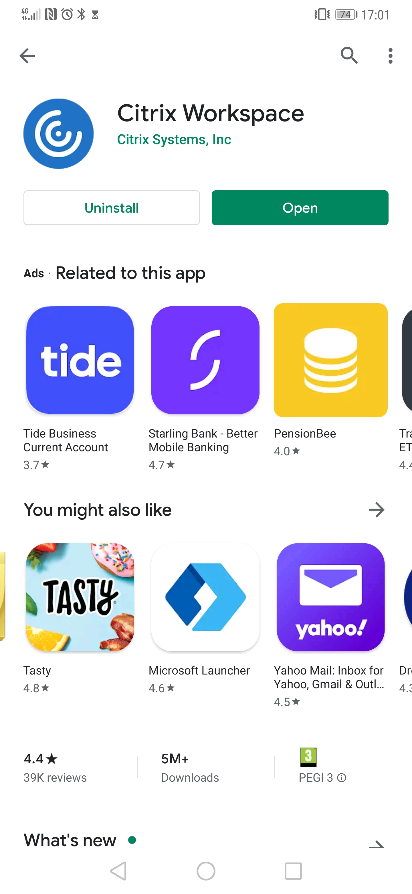

After launching Citrix Workspace for the first time, you will receive four notifications from your phone asking to "Allow Workspace to access photos, media and other files on your device?" Please select "Allow" for the set-up to continue(Refer to **_image 4 below_**). 

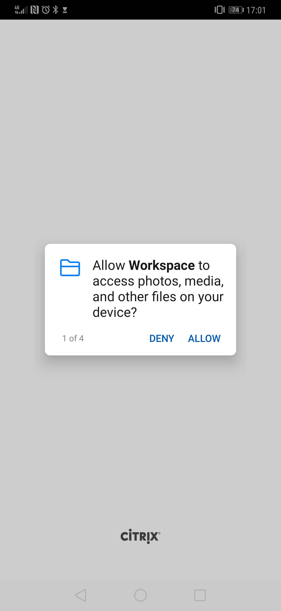

Once finished, you will be prompted to enter a company email address or store URL. Simply type the following URL `“https://www.fastdesk.co.uk” and click Continue`. Do make sure you enter the full URL including the `"https://www."`. Please leave the "Add account type as Web Interface" unselected (Refer to **_image 5 below_** included).

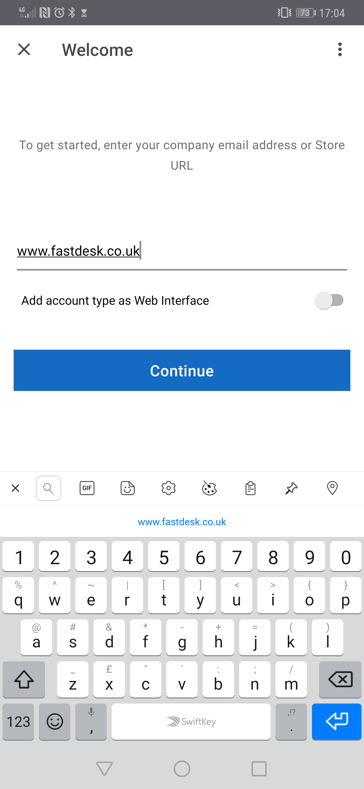

If you get a prompt to save the URL, the option is yours as to whether you want the URL saved or not but we would recommend it as it makes it easier to log on on a day-to-day basis (See **_Image 6 below_**).

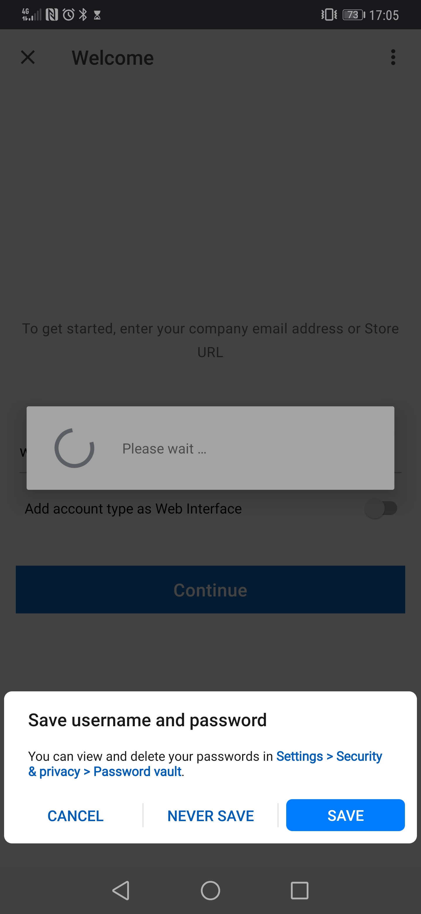

You will then be prompted to enter your username and password into the application. Go ahead and enter the username and password credentials that were provided to you by the FastDesk team (See **_Image 7 below_**). 

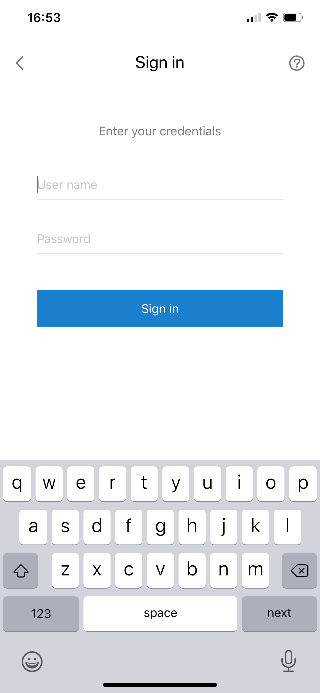

```eval_rst
.. note::

   Once successfully logged in for the first time, you will be asked to change your password. Your password must be a minimum of 8 characters in length and contain at least 3 of the following: uppercase letters, lowercase letters, numbers, symbols and special characters e.g “! ” £”. Your password can also not contain the name of your account. For example, if your account name is John Smith, a password with the word ‘john’ will not be accepted.

```

## Step 3 - Launching a desktop from the Portal
When you first log in, you will notice there is nothing to click except the menu button in the left top corner of the screen and the search button in the top right corner of the screen(refer to **_image 8_** below). 

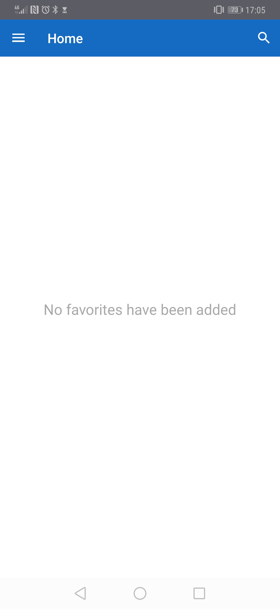

Select the menu button and there is a list of options (Home, Apps, and Desktops). Refer to **_image 9_ below** for a visual representation. The "Home" section in the menu contains hosted desktops you have tagged as your favourites whilst the "Apps" section presents you with specific applications that have been made available to you. In most cases, you will not use this section. The "Refresh" options will reset your connection to the application whilst the "Settings" section presents you with the settings you can customise including the ability for you to manage your accounts. 

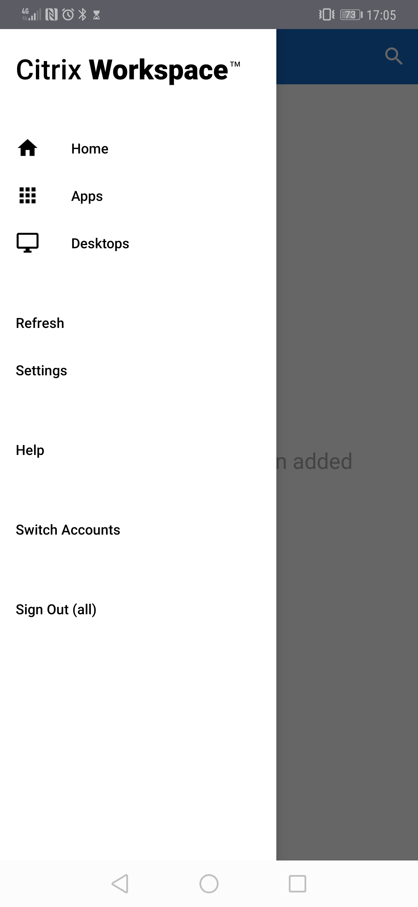

Select Desktops by clicking on the text "Desktops". This should present you with the desktops that have been allocated to you. In the case of **_image 10_** below, this is the client Desktop Demo.)  

 that have been allocated to you")

Go ahead and select the desktop by clicking on it and this will begin to launch your desktop (see **_image 11_** below).

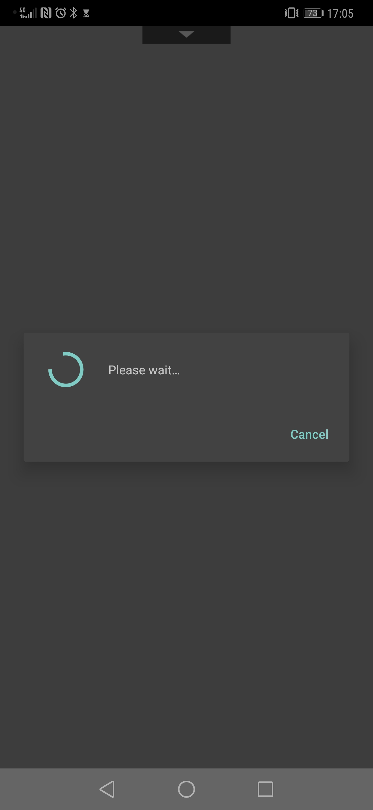

Upon loading, the gestures manual should appear giving you details on how to interact with your desktop (see **_image 12_** below).

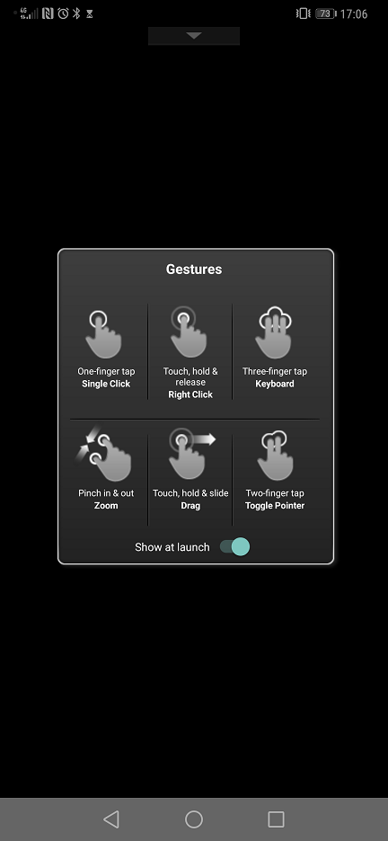

Upon loading, the gestures manual should appear giving you details on how to interact with your desktop (see **_image 12_** below).


Click anywhere on the screen to close this manual and access the desktop (See **_image 13_**).

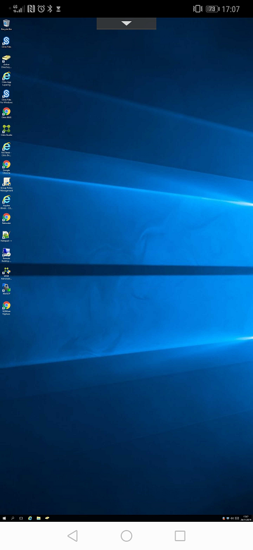

Begin navigating your desktop following the instructions that were provided with the gestures manual.

You can later set the desktop that has been allocated to you as a "Favorite". This will allow it to appear as soon as you log in.

```eval_rst
.. warning::

   Whenever you log out of a desktop, do allow at least 3 minutes before attempting to log back in. This is to ensure the session correctly ends before another one is open. If you have not waited long enough, there is a danger of your applications not appearing when you log in. If you do find that this is the case, simply log out, wait at least 3 minutes and log back in again.
   
```

**_This instruction guide should assist you in getting logged in for the first time. If you have any questions or still require assistance, please contact the FastDesk support team on 0800 923 0617_**.

   ```eval_rst
  .. title:: {title goes here}
  .. meta::
     :title: FastDesk Getting Started Guide: Android | UKFast Documentation
     :description: Guide for users on how to get setup on FastDesk using an Android Device
     :keywords: FastDesk, Citrix, ukfast, VDI, Citrix Receiver 

