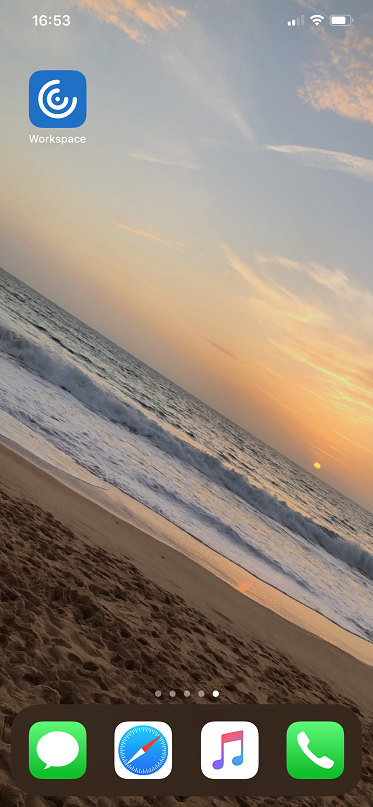
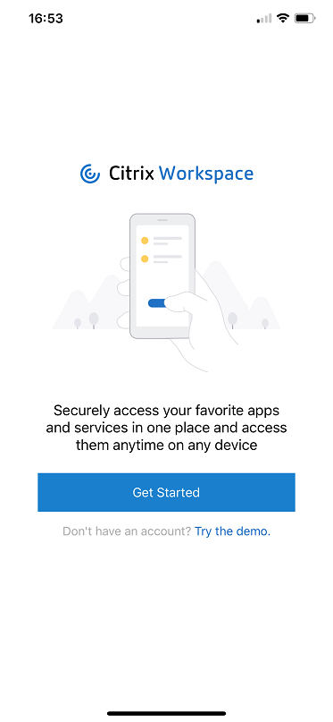
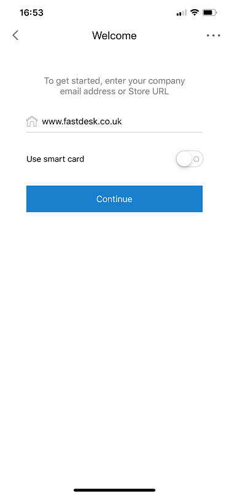
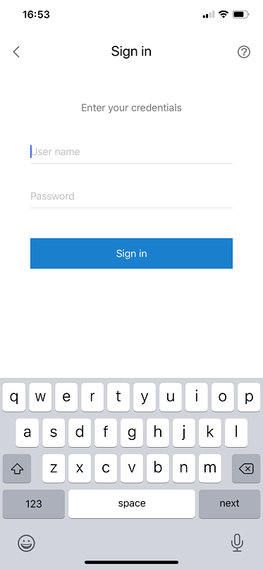
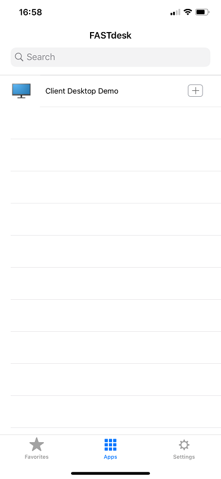
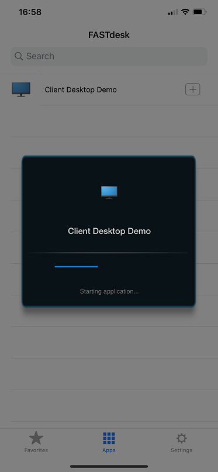
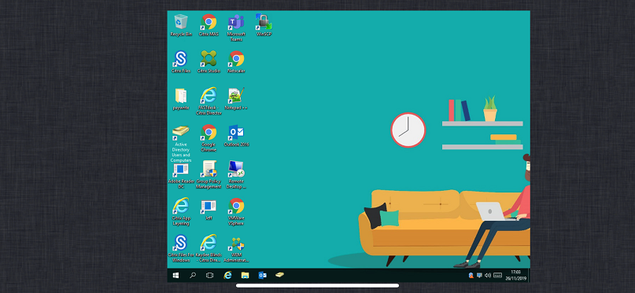

# Launch FastDesk on a iOS Device

FastDesk®  is UKFast's Desktop as a Service (DaaS) solution, which allows users and organisations to work more effectively and securely by giving access to files, applications, and desktop items remotely via an internet connection. All desktop settings and files are stored remotely in the cloud, providing cross-device compatibility and eliminating the risk of data loss by removing the risk of unauthorised access. This DaaS solution allows users to work in the same way they would with a traditional local desktop, but increase the flexibility with which they do so regardless of the endpoint device hardware, operating system or form factor.

 ```eval_rst
.. note::

   Compatible with iPhone 7x models, iPhone 8x models and only iPhone X model. All iPad models (including iPad Pro) are supported except for iPad 1 and iPad 2. For the most optimum experience, we recommend updating your iOS device to the latest iOS release.

```

## Pre-Installation information

This guide provides step by step instructions on installing and accessing FastDesk on your Apple iOS devices through the Citrix Workspace application. It is possible to access FastDesk through the web portal on your iOS device, however, it is recommended FastDesk is accessed specifically through the Citrix Workspace Application. If you currently use the older Citrix Receiver for iOS, Citrix Workspace will replace this. The Citrix Workspace application gives you:

- Instant access to your FastDesk environment in an easy-to-use, all-in-one interface.
- Full integration with the Citrix Content Collaboration (Also known as ShareFile) which gives you ability to upload and download files all within the one application.

## Step 1 - Installing the Citrix Workspace Application

On your iOS device, navigate to and open the App Store. Once complete, use the application search bar to look for "Citrix Workspace". When found, please refer to **_image 1 below_** to ensure it is the correct application. Once confirmed, proceed to install the application.


## Step 2 - Logging into FastDesk via the Citrix Workspace Application

Once the "Citrix Workspace" application is installed, it will appear within your apps just like in **_image 2 below_**.




Proceed to open it. After launching Citrix Workspace for the first time, it will bring you to the landing page like in **_image 3 below_**.





Continue to select "Get Started".  You will then be prompted to enter a company email address or store URL. Simply type the following URL `"https://www.fastdesk.co.uk"` and click Continue. Do make sure you enter the full URL including the `"https://www."`. Please use **_image 4 below_** as an example.



You will then be prompted to enter your username and password into the application. Go ahead and enter the username and password credentials that were provided to you by the FastDesk team (See **_image 5 below_**).



```eval_rst
.. note::

   Your new password must be a minimum of 8 characters in length and contain at least 3 of the following: uppercase letters, lowercase letters, numbers, symbols and special characters e.g "! " £". Your password can also not contain the name of your account. For example, if your account name is John Smith, a password with the word 'john' will not be accepted. Once your password has been reset, it should simply log you in. It may ask you to dectect receiver, if so, simply select the option that allows it to detect the receiver.

```

## Step 3 - Launching a desktop through the Citrix Workspace Application

Once logged in, you will notice that towards the bottom of the page, there are three different sections named "Favorites", "Apps" and "Settings".  When you initially log in, you are shown the "Apps" section by default (See **_image 6 below_**).



The "Favorites" page contains hosted desktops you have tagged as your favourites whilst the "Settings" section presents you with the settings you can customise. You can later set the desktop that has been allocated to you as a "Favorite". The "Apps" page presents you with the hosted desktop(s) that has been allocated to you. From the "Apps" section, you will be able to launch your desktop. To do this, select the hosted desktop that has been allocated to you. As an example, please refer to **_image 7 below_** for a visual example (In this case, it would be "Client Desktop Demo").



Once selected, it should begin to launch your desktop. Once this has booted, your FastDesk is ready for you as shown in **_image 8 below_**.



```eval_rst
.. warning::

   Whenever you log out of a desktop, do allow at least 3 minutes before attempting to log back in. This is to ensure the session correctly ends before another one is open. If you have not waited long enough, there is a danger of your applications not appearing when you log in. If you do find that this is the case, simply log out, wait at least 3 minutes and log back in again.

```

**_This instruction guide should assist you in getting logged in for the first time. If you have any questions or still require assistance, please contact the FastDesk support team on 0800 923 0617_**.


 ```eval_rst
   .. title:: FastDesk Getting Started Guide: iOS
   .. meta::
      :title: FastDesk Getting Started Guide: Apple iOS | UKFast Documentation
      :description: Guide for users on how to get setup on FastDesk using an iOS
      :keywords: FastDesk, Citrix, ukfast, VDI, Citrix Receiver
```

