# Launch FastDesk on a Windows Device

FastDesk®  is UKFast’s Desktop as a Service (DaaS) solution, which allows users and organisations to work more effectively and securely by giving access to files, applications and desktop items remotely via an internet connection. All desktop settings and files are stored remotely in the cloud, providing cross-device compatibility and eliminating the risk of data loss by removing the risk of unauthorised access. This DaaS solution allows users to work in the same way they would with a traditional local desktop, but increase the flexibility with which they do so regardless of the endpoint device hardware, operating system or form factor.

```eval_rst
.. note::

   Compatible with Windows 7, 8.1, 10 (32-bit and 64-bit editions). Also compatible with Windows Thin PC as well as Windows Server 2008 (R2, 64-bit), 2012 (R2, Standard, and, Datacenter editions)
   
```

## Pre-Installation information

This guide provides step by step instructions on installing and accessing FastDesk on your Windows PC device. Day-to-day, there are two available methods to access FastDesk on your Windows PC. These methods consist of the [web portal](https://www.fastdesk.co.uk/) and the Citrix Workspace Application. Whilst this guide will help you install the Citrix Workspace Application in order to access FastDesk for the first time, we highly recommend using the web portal to access FASTdesk on a day-to-day basis. Both the Citrix Workspace application and web portal gives you:

- Instant access to your FastDesk environment in an easy-to-use, all-in-one interface.
- Ability to use the FastDesk on domain and non-domain joined PCs and thin clients. 
- Full integration with the Citrix Content Collaboration (Also known as ShareFile) which gives you the ability to upload and download files all in one place.

To install the Citrix Workspace Application on the local machine, there is a minimum memory requirement of 1GB RAM. In addition, two pre-requisites must be installed. They are:

- .NET Framework 4.6.2 or later. 
- Microsoft Visual C++ Redistributable 14.16.27012.6 or later (requires admin access). 

These pre-requisites are normally installed with Windows updates so if your version of Windows is up to date, you should not have to install these. Alternatively, the Citrix Workspace application also attempts to install them during intallation. **(See Step 1)**. If none of these steps result in the installation of the pre-requisites, please visit the Citrix help page at:
`https://support.citrix.com/article/CTX250044?_ga=2.101236417.1997404425.1578506907-124105596.1573051453`. Alternatively, you can click this [link here](https://support.citrix.com/article/CTX250044?_ga=2.101236417.1997404425.1578506907-124105596.1573051453) to take you to the website.


## Step 1 - Installing the Citrix Workspace Application

From your Windows PC, download and install the latest version of the Citrix Workspace app at this URL:
`https://www.citrix.co.uk/downloads/workspace-app/`. Alternatively, you can click this [link here](https://www.citrix.co.uk/downloads/workspace-app/) to take you to the website.


As you can see from the **image 1** below, all versions of Workspace are listed. 

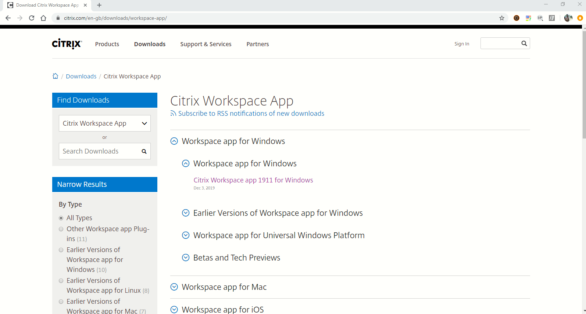

Expand the `"Workspace app for Windows"` section and select the latest version of the `"Workspace app for Windows"`. This takes you to the download link where you can download the application (See **image 2**).

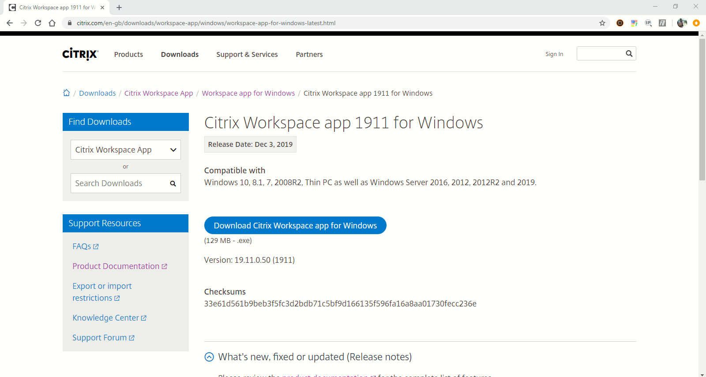

Once the file has downloaded, open the file to begin installation. You might get a security warning asking `"Do you want to run this file?"`. Check that the `"Publisher"` identifies as `"Citrix Systems, Inc."` before selecting Run (Refer to **image 3** included).


Follow the installation dialog box to finish with the installation of the workspace app ( **Image 4** provides a visual representation).

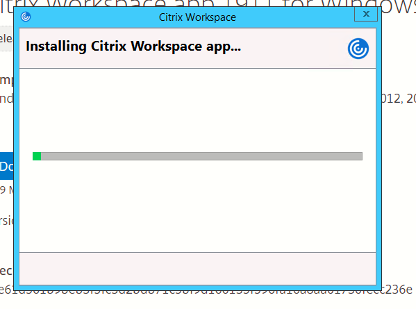

## Step 2 - Logging into the FastDesk Web Portal

Once the "Citrix Workspace" application is installed, open your web browser and navigate to the Following URL `"https://www.fastdesk.co.uk"`. On this step, it is vital that you enter the full URL including the `"www"`. Alternatively, you can click this [link here](https://www.fastdesk.co.uk) to take you to the website. In terms of browsers, the web portal is compatible with the latest versions of Google Chrome, Mozilla Firefox, Microsoft Edge and Internet Explorer.


Once here, you will see the FastDesk branding and a log in page with a man on a sofa (Refer to **image 6** below). 


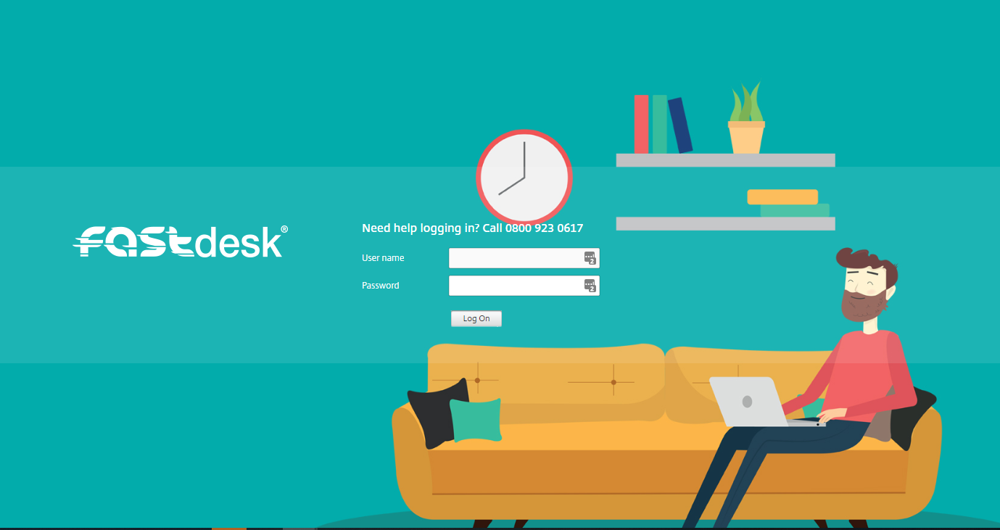

Go ahead and enter the username and password credentials that were provided to you by the FastDesk team. Upon entering your credentials, you will be asked to change your password (See **image 7**). 

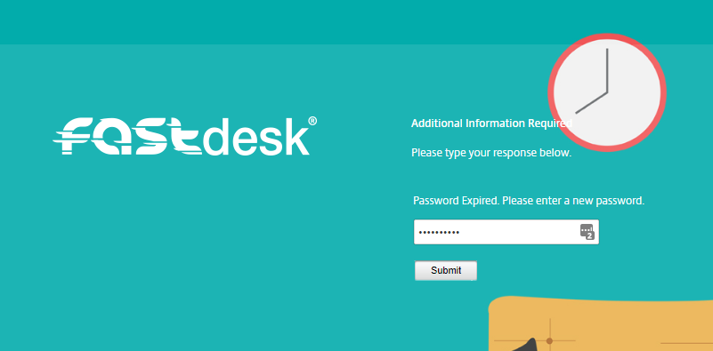

```eval_rst
.. note::

   Your new password must be a minimum of 8 characters in length and contain at least 3 of the following: uppercase letters, lowercase letters, numbers, symbols and special characters e.g “! ” £”. Your password can also not contain the name of your account. For example, if your account name is John Smith, a password with the word ‘john’ will not be accepted. Once your password has been reset, it should simply log you in. It may ask you to dectect receiver, if so, simply select the option that allows it to detect the receiver.
   
```

## Step 3 - Launching a desktop from the Web Portal

Once you have logged into FastDesk, you will be presented with the applications and hosted desktops that have been allocated to you (Refer to **image 8**). 

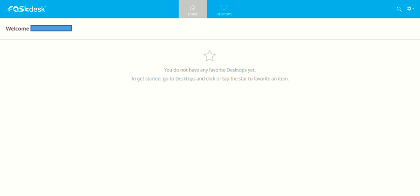

You can navigate between Desktops and Apps via the icons found at the top of the screen. The icons found at the top of the screen also gives you the ability to search as well as open settings. Simply click Desktops to navigate to this category (Refer to **image 9**).

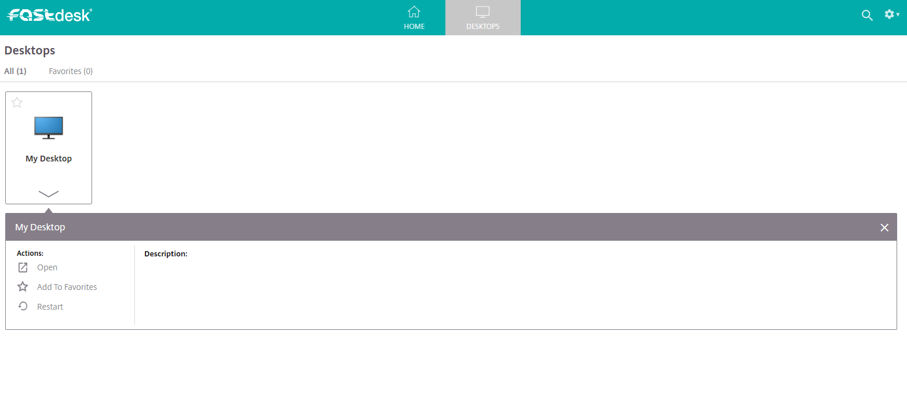

Once in the desktops categories, you can open the desktop that has been allocated to you by just clicking the monitor of the desktop or by clicking the downward arrow which will give you three options of `"Open"`, `"Add To Favorites"` and `"Restart"`. You can also choose to `"Add To Favourites"`, which pins your desktop to the Favourites category. From here you can also click `"open"` (Refer to **image 9**).

When either the monitor or open button has been clicked, you will get a pop up that asks `"Open Citrix Workspace Launcher?"` (Refer to **image 10**). Next, allow it to open the Launcher. 

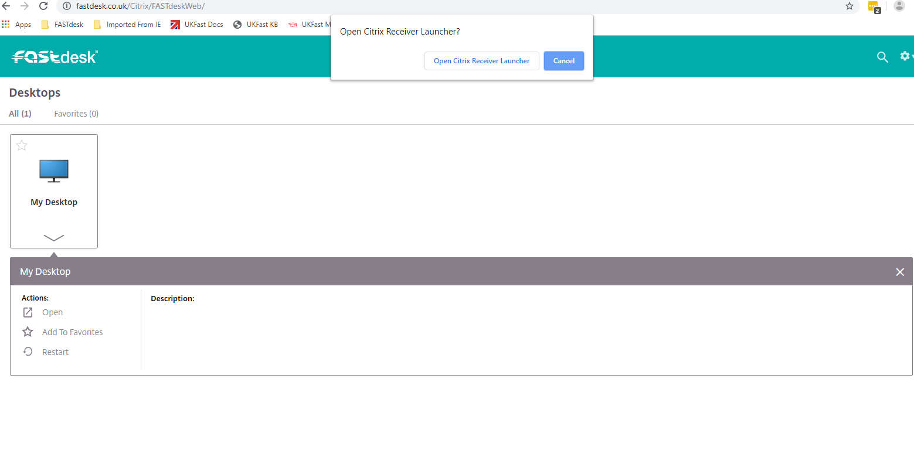

Upon opening this, your desktop will begin to launch in another window (Refer to image **image 11** included). 

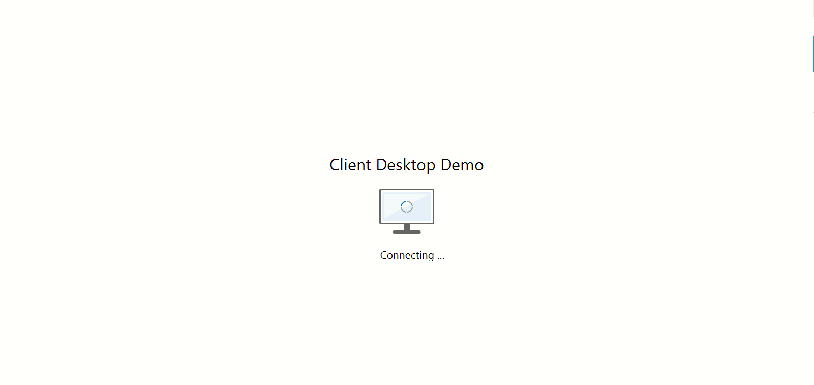.

Once fully launched, your desktop should appear as it is in **image 12**. 

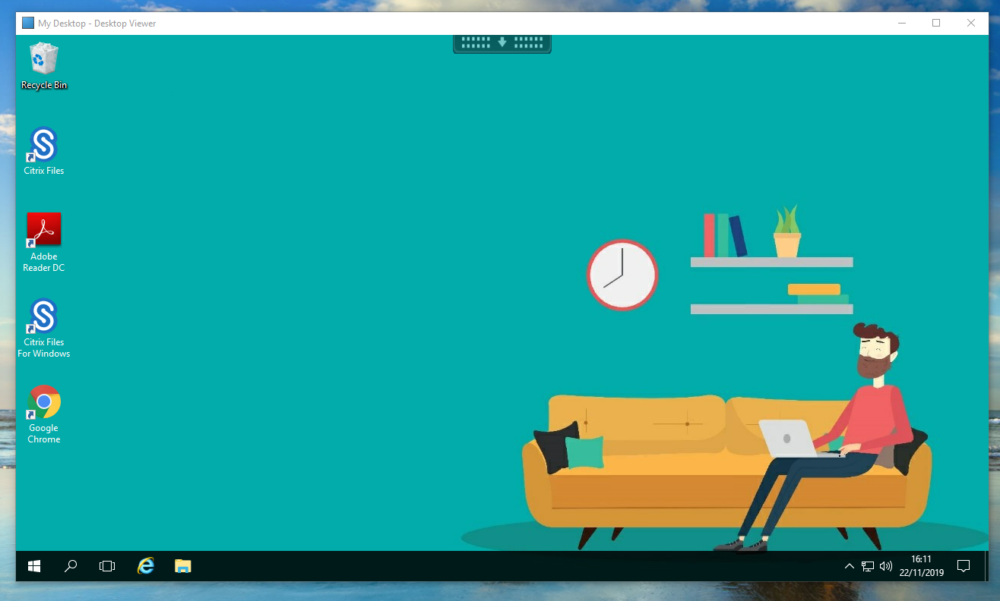

## Workspace Application Log in setup (Optional)

Although it is recommended you access FastDesk through the URL, you can also access your desktop through the Citrix Workspace Launcher. If you prefer to login directly to the Citrix Workspace app, you can do so. Simply click your windows start menu button and search for `"Citrix Workspace Application"`. After launching the Citrix Workspace app, you will be asked to add an account. See **image 13**

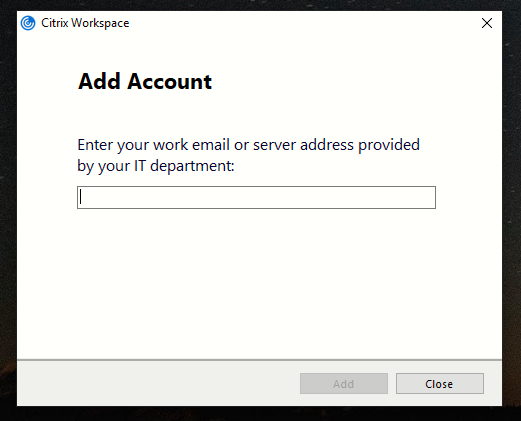

Simply type the following URL `"https://www.fastdesk.co.uk"` and click Add. Alternatively, enter the URL that has been provided to you by the FastDesk team if you have a private fastdesk. You will then be prompted to enter your username and password into the application. See **image 14.**

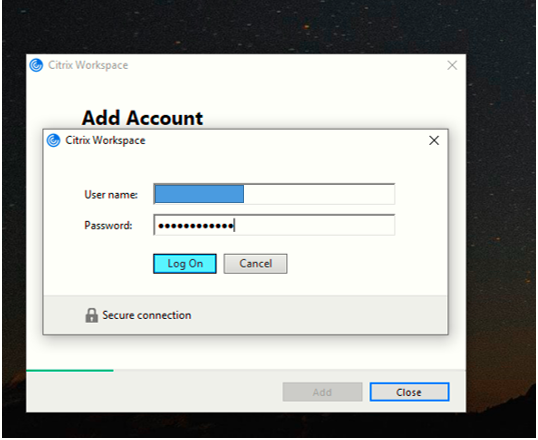


```eval_rst
.. warning::

   Whenever you log out of a desktop, do allow at least 3 minutes before attempting to log back in. This is to ensure the session correctly ends before another one is open. If you have not waited long enough, there is a danger of your applications not appearing when you log in. If you do find that this is the case, simply log out, wait at least 3 minutes and log back in again.
   
```

**_This instruction guide should assist you in getting logged in for the first time. If you have any questions or still require assistance, please contact the FastDesk support team on 0800 923 0617_**.

 ```eval_rst
    .. title:: FastDesk Getting Started Guide: Windows OS
   .. meta::
      :title: FastDesk Getting Started Guide Windows PC Edition | UKFast Documentation
      :description: Guide for users on how to get setup on FASTdesk using a Windows PC 
      :keywords: FastDesk, Citrix, ukfast, VDI, Citrix Receiver, Windows, Workspace Application 
```
