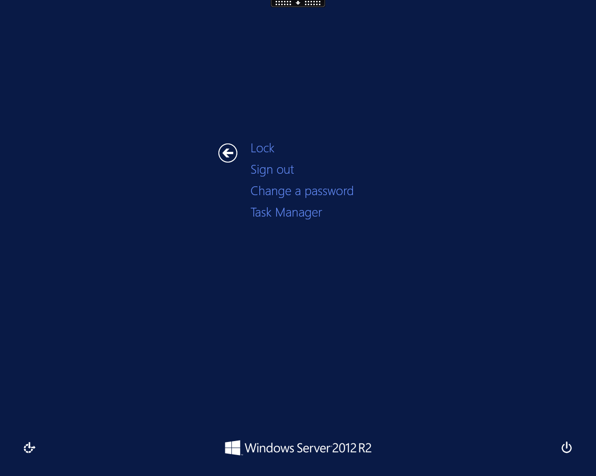
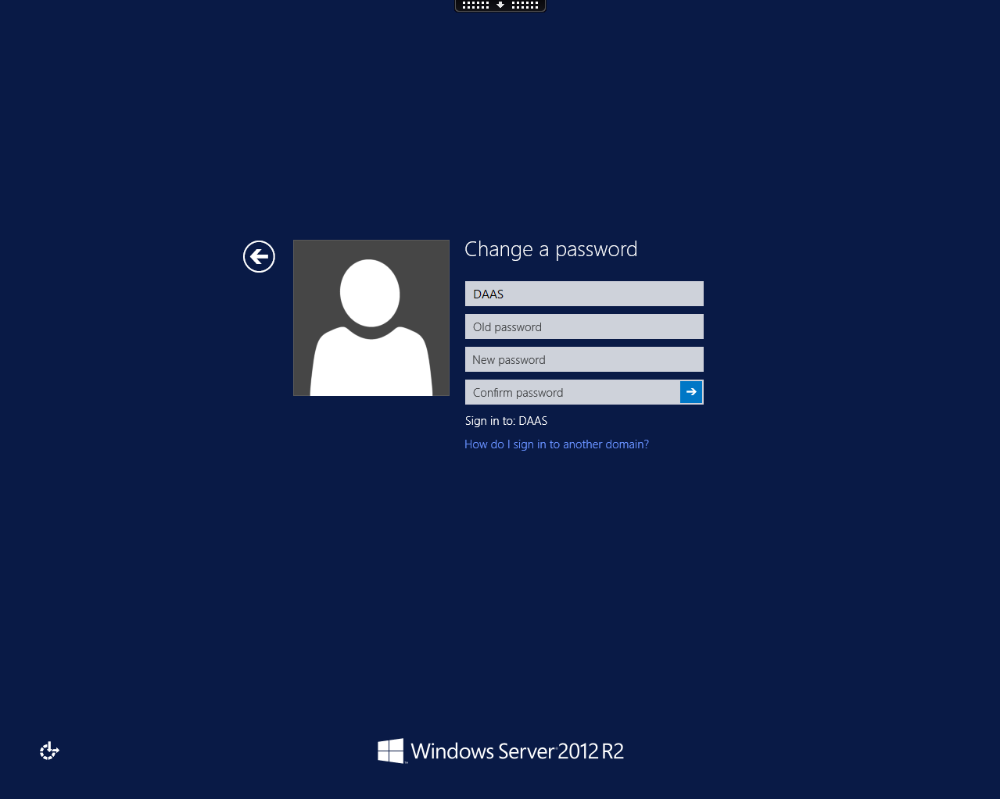
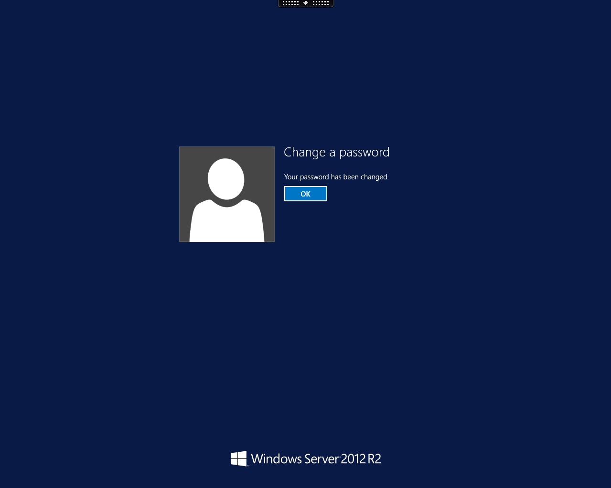
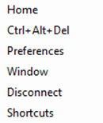

# How can I reset my FASTdesk password?

FASTdesk passwords can be reset within your virtual desktop. To reset your password, firstly launch your desktop.

At the top of your screen you should be able to see a small black icon.

Click this icon and it will expand and you'll be able to see a variety of options. Here, Click __Ctrl + Alt + Del__.

You'll then be able to see 4 options. One of these options is __Change a password__. Click this in order to change your password.

On the next screen, enter your old password and enter your new password twice for validation purposes.

You'll then be notified that your password has been changed successfully.

Alternatively, you can also change your password by pressing __Ctrl + Alt + Break__ at the same time. Once you've done this, you'll see the following screen:

Use your arrow keys in order to select __Ctrl+Alt+Del__.

 
Then, as we've gone through previously, click __Change a password__ in order to change your password.

Then, enter your old password and enter your new password twice for validation purposes.

You'll then be notified that your password has been changed successfully.

## FASTdesk password information

Your FASTdesk password will expire every 6 weeks and you will be prompted to change it when you log in. Upon expiry you should see a
screen similar to the one below.

Here, you need to enter a password which matches the FASTdesk password requirements. For security purposes, passwords must be 8
characters or longer and include mixed case and at least one number.

You'll then be asked to confirm this password. If the passwords that you entered matched correctly, you will be logged in
successfully and you'll see a screen similar to the one below.

If you have forgotten your password and would like it to be reset, this is something that can only be done by FASTdesk Support. In order to reset your password, you can email support@ukfast.co.uk, create a ticket via https://my.ukfast.co.uk/pss/add.php or ring our FASTdesk Support Line directly on 0800 923 0617.
