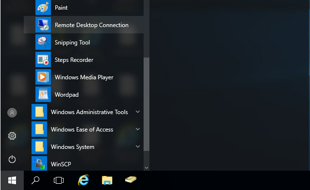
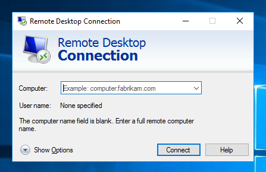
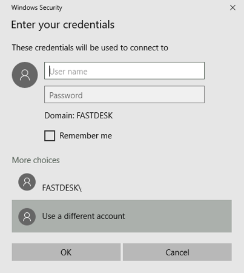
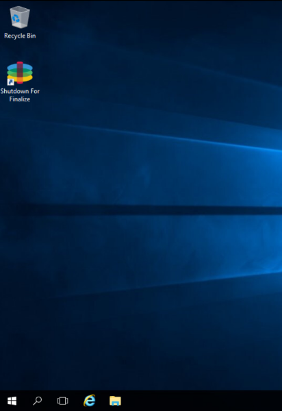

# How to install or update an Application

FastDesk desktop sessions are non-persistent which means that upon reboot, they revert to the base image template. For example, Overnight. Therefore any applications that you wish to persist longer should be installed on an application layer. An application layer is a virtual machine (VM) that is designed for installing applications. Once applications have been installed, the app layer is powered off and pushed out to users. Applications are then stored as a layer that attaches to your profile upon login. The FastDesk team typically put all of your applications on one application. However, there are instances in which you may have multiple application layers.

```eval_rst
.. note::

   Your FastDesk profile comes equipped with a HomeDrive which is also persistant storage location. However this alone will not allow applications to persist.

```

## Step 1 - Request UKFast to open Application Layer

If you would like to install an application, you will need to contact the FastDesk support team to request an app layer to be opened. The FastDesk support team will let you know that the layer has been opened and they will provide you with the details needed to log in. Once the application layer is open, you will be able to connect to and access it so that you may perform your application installations or updates.


## Step 2 - Accessing the Application Layer

To access the app layer, you will need to log into your database user, this is accessed the same way as you would access your desktop when you login. From the FastDesk login page, enter the credentials for the database user (which will have been provided to you through email or ticket when your database machine or entire solution was setup).


```eval_rst
.. note::

  If you do not have a database user, you will have been assigned the correct permissions to access the Application Layer from your regular FastDesk Desktop. Follow the same steps as below but through your personal desktop instead.

```
Once you are logged in, please open up the database user desktop as usual.

Next, you will need to open up `"Remote Desktop Connection"`. Refer to **Image 2** below. To find this, you may need to search for it or find it within the list of applications.



Once this is open, you will need to enter the IP Address which the support engineer has provided in the ticket. Refer to **Image 3** below.



When you have entered this, you will then be prompted to enter a username and password. The username and password needed will be provided to yourself through the ticket system via a ticket that will be raised in regards to your application install or update. Refer to **image 4** below.



## Step 3 - Installing or Updating the Application(s)

Once the application layer has been launched, you will see the `Recycle Bin` as well as a `Shutdown for Finalize` shortcut. You now have elevated admin privileges to install and/or update applications. Please install or update any applications that you have requested be added. Refer to **Image 5** below.



  ```eval_rst
.. warning::

   Please do not shut down or finalize the application layer. Doing this will make it inaccessible and will require us to open a new application layer for yourself.

```
When installing an application, you may be required to enter a data path (some applications only). For this you can use your Database/App/File server. For more information on this, please contact our support team.

Once complete, please sign out of the application layer.  For more information on how to do this, please visit our guide on how to properly sign out of your desktop [link here](https://docs.ukfast.co.uk/desktop/fastdesk/signout.html)

Once signed out, please inform the FastDesk team that you are ready to push this layer out to users. If you are installing an application for the first time, please state which users you want to have access to the application.

To allow for the updated application to come through on your desktop yourself, and other users looking for the updated application layer will need to sign out of your desktop, wait a few minutes and then sign back in. After doing so the updated or newly installed application will appear on your desktop.

## Additional Content - Accessing without a Database user

Following the instructions of Step 1, you should have the credentials for the app layer. To access the app layer, you will need to log as your FastDesk user.

Within your FastDesk session, you will need to open up `"Remote Desktop Connection"`. Refer to **Image 6** below. To find this, you may need to search for it or find it within the list of applications.


Once this is open, you will need to enter the IP Address which the support engineer has provided in the ticket. Refer to **Image 7** below.


When you have entered this, you will then be prompted to enter a username and password. This is where you will need to enter the username and password which has been supplied in the support ticket.

Once you have entered the details, you will then be signed into your application layer. Please go back to Step 3 to finish the tutorial.

**_This instruction guide should assist you in installing or updating applications on an application layer. If you have any questions or still require assistance, please contact the FastDesk support team on 0800 923 0617_**.

```
  ```eval_rst
      .. title:: Installing or Updating an Application | UKFast Documentation
      .. meta::
      :title: Guide on how to change your FastDesk Paswword | UKFast Documentation
      :description: Guide for users on how to install or update and application
      :keywords: FastDesk, Citrix, VDI, Citrix Receiver, Windows, Workspace Application, Application, Layer, Database, Installation, Updating, LOB, Line of Business
      ```
