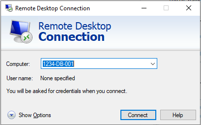

# How to log into the Database

If you have purchased any additional virtual machines (VMs) from UKFast (Database Server, Application Server, File Server), you will be provided with an additional user which is called `Database user`. This user is a regular FastDesk user with elevated permissions that allows it to connect to any additional VMs as well as the application layer (For more information on accessing the application layer, please visit our guide [link here](https://docs.ukfast.co.uk/desktop/fastdesk/applayerlogin.html).

## Step 1 - Login as Database User

To access your additional VM, you will need to log into your database user desktop, this is accessed the same way as you would access your desktop when you login. From the FastDesk log in page, enter the credentials for the database user (which will have been provided to you through email or ticket when your database machine or entire solution was setup).


Once you are logged in, please open up the database user desktop as usual.

## Step 2 - Log into the Database

Once the database user desktop has launched, navigate to the search bar and search for `Remote Desktop Connection`. Open `Remote Desktop Connection`. Refer to **image 2** for visual guidance.


Once open, enter the `Host name` or the `IP address` of the database you wish to connect into.



```eval_rst
.. note::

  The hostname will be your server ID (DAAS ID) followed by the type of server followed by the number. E.g. 1234-DB-001. This should be provided to you in a ticket. Alternatively, you can request the IP address of the VM and use that instead.

```

Once you have entered the `Host name` or the `IP address` of the database/additional VM you wish to connect into, you will be prompted to enter the server name and password. The username and password needed will be provided to you through the ticket system via a ticket that will be raised in regards to your application install or update. Refer to **image 3** below.


Once entered, this will launch your additional VM in a new window.

**_This instruction guide should assist you in being able to access your database or any additional FastDesk VMs. If you have any questions or still require assistance, please contact the FastDesk support team on 0800 923 0617_**.


 ```eval_rst
   .. title:: Logging into your database | UKFast Documentation
   .. meta::
      :title: How to log into your Database | UKFast Documentation
      :description: Guide for users on how to install or update and application
      :keywords: FastDesk, Citrix, VDI, Citrix Receiver, Windows, Workspace Application, Application Layer, Database, Additional, Updating, LOB, Line of Business

