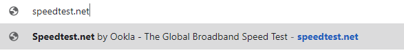
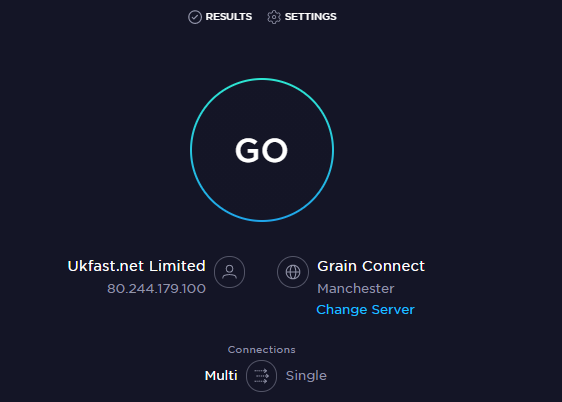
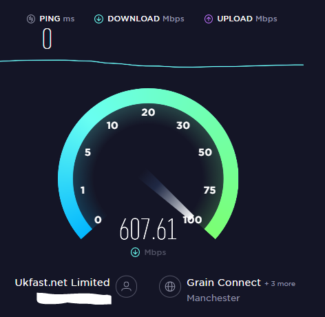

# How to run an Internet Speed Test

Poor internet connectivity may hinder the performance of your FastDesk desktop. At times, we may ask you to run an internet speed test to rule this out as a possible problem. This guide should walk you through running a speed test.

To run an internet speed test, completely sign out of your FastDesk session. For more information on how to do this, please visit our guide on how to properly sign out of your desktop [link here](https://docs.ukfast.co.uk/desktop/fastdesk/howtoguide/signout.html)

Next, on your local device (the device you would use to access FastDesk) open up an internet browser window. E.g. Chrome, Microsoft Edge. Browse to https://www.speedtest.net/ or click this [link here](https://www.speedtest.net/)



Next, click `"Go"`.



Please let this test run.



Once this test has been completed, please screenshot this page and send the results via the support ticket or provide the statistics to a FastDesk Engineer.

```eval_rst
.. note::

  This guide is aimed at helping you to run a speed test outside of your FastDesk session. If you have any questions or still require assistance, please contact the FastDesk support team on 0800 923 0617.

```

```eval_rst
   .. title::  FastDesk | Running a speed test
   .. meta::
      :title: Running a speed test | ANS Documentation
      :description: Guide for users on how to run an internet speed test outside of the FastDesk environment
      :keywords: FastDesk, Endpoint, ukfast, Internet, Citrix Receiver, Windows, Workspace Application, Change, Test, Web, Speed
```
