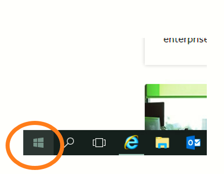
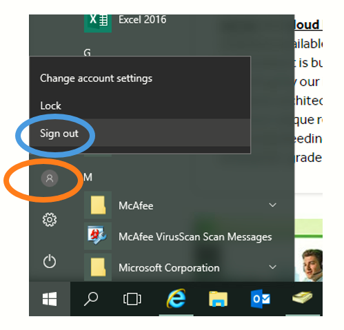

# How to effectively end your FastDesk Desktop session

```eval_rst
.. warning::

   Please be aware, it takes a few minutes for FastDesk to completely sign out in the background. This extends to even when the window has been closed. Please leave at least 3 minutes after clicking the "Sign out" button before attempting to log back on.

```

## What is signing out and when should I do it?

Signing out completely ends the session so that when you log back in, nothing has been left open from your previous session. Sometimes signing out is necessary. E.g. If a new application has been deployed to your desktop, a full sign out is needed to apply the changes.

## How do I sign out?

To sign out of your FastDesk desktop, firstly find and click on the start menu button in the bottom-left of your desktop window, as circled in **image 1**.



Once clicked, the start menu should open. You'll find three icons just above the Windows start menu button. The top icon will show your user icon, or a grey outline of a head and shoulders (refer to **image 2**).



As illustrated in **image 2**, clicking on the icon (outlined in orange) will bring out a menu. Select the "Sign out" option (outlined in blue) and this will begin to fully sign out your FastDesk desktop.


## What is disconnecting and when should I do it?

Disconnecting your FastDesk Desktop is a convenient way of leaving your session on standby. Disconnecting leaves everything running on your desktop so you can connect in later (Perhaps from a different device) and still find your apps and files open as you left them.

Whenever you disconnect, your session is still active in the background, and therefore, you will not benefit from some of the changes or policies that are applied to your FastDesk whilst your session is in its current state.  You can opt to disconnect your FastDesk session if you are leaving your desktop for a short period. For anything longer than a couple of hours, we would recommend completely signing out.

## How do I disconnect?

You can disconnect by simply closing your Citrix Workspace Window or web browser session. Alternatively, you can also disconnect by clicking the disconnect button in the start menu (Refer to **image 1** in sign out section. ).

```eval_rst
.. note::

   This instruction guide should assist you in learning how to effectively sign out of your FastDesk session. If you have any questions or still require assistance, please contact the FastDesk support team on 0800 923 0617.

```
```eval_rst
  .. title:: FastDesk | How to sign out of the FastDesk Desktop
  .. meta::
     :title: Signing out of FastDesk Desktop | UKFast Documentation
     :description: Guide for users on how to effectively sign out of the FastDesk Desktop session
     :keywords: FastDesk, Citrix, ukfast, VDI, Citrix Receiver, Windows, Workspace Application, Desktop
```
