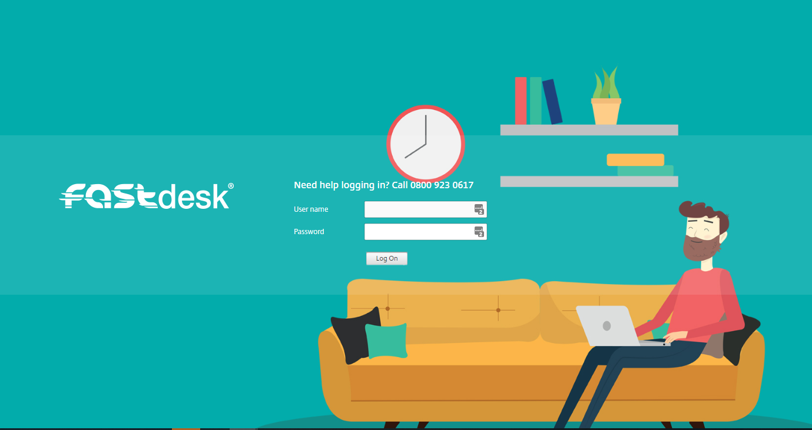

# How to change your FastDesk Password

You have the ability to change your own FastDesk password if you are not already locked out of your account. If you are already locked out then please contact our support team either by emailling support@ukfast.co.uk or by calling 0800 923 0617. If you are not locked out, youu can change your password either through the web portal or via the Citrix Workspace Application. 

```eval_rst
.. note::

  This guide is specifically on completing this through the FastDesk web portal because UKFast recommends completing this through the Web Portal only.
   
```

## Change your FastDesk Password through the Web Portal

From your local PC, browse via an internet browser to the FastDesk web portal [link here](https://www.fastdesk.co.uk). Once here, you will see **Image 1** as shown below. Please log in with your FastDesk username and password.



Once logged in, you will need to navigate to the top right of the page where you will find the settings cog (**refer to image 2**). 


Click on this cog will bring up multiple options.


Next, select *“Account Settings”* which will take you to another page.


On this page you will find “Change Password”. Here you will be able to change your password to something new. 


```eval_rst
.. warning::

   Your new password must be a minimum of 8 characters in length and contain at least 3 of the following: uppercase letters, lowercase letters, numbers, symbols and special characters e.g “! ” £”. Your password can also not contain the name of your account. For example, if your account name is John Smith, a password with the word ‘john’ will not be accepted.
   
```
Once your password has been changed, it should simply log you in. It may ask you to detect receiver, if so, simply select the option that allows it to detect the receiver.

```eval_rst
.. note::

   This instruction guide should assist you in changing your FastDesk password. If you have any questions or still require assistance, please contact the FastDesk support team on 0800 923 0617.
   
```
  ```eval_rst
      .. title:: FastDesk | Changing FastDesk Password
      .. meta::
      :title: Guide on how to change your FastDesk Paswword | UKFast Documentation
      :description: Guide for users on how to change their FastDesk Password
      :keywords: FastDesk, Citrix, ukfast, VDI, Citrix Receiver, Windows, Workspace Application, Password, Change, Reset, Web, Portal
      ```  
