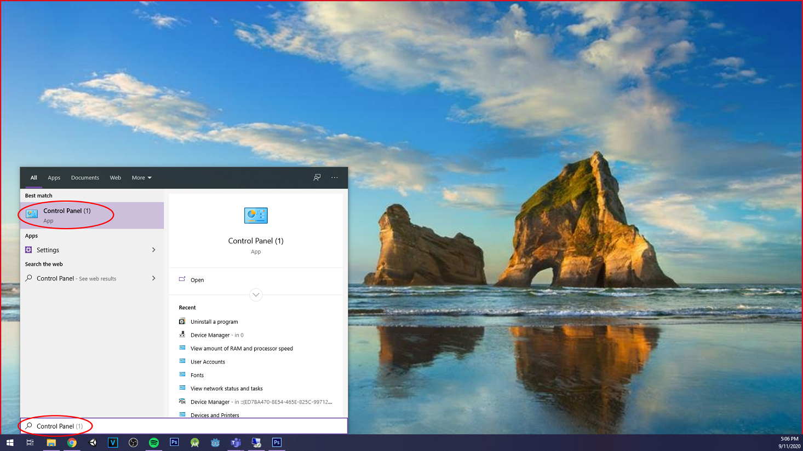
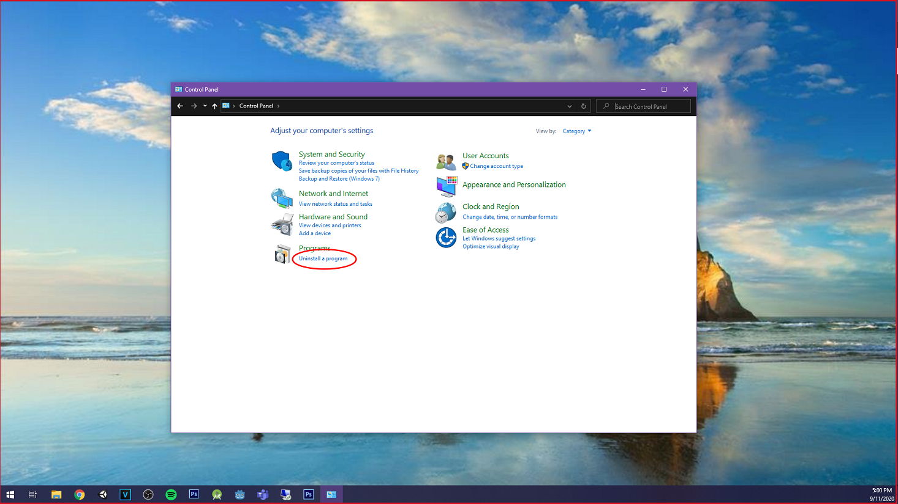
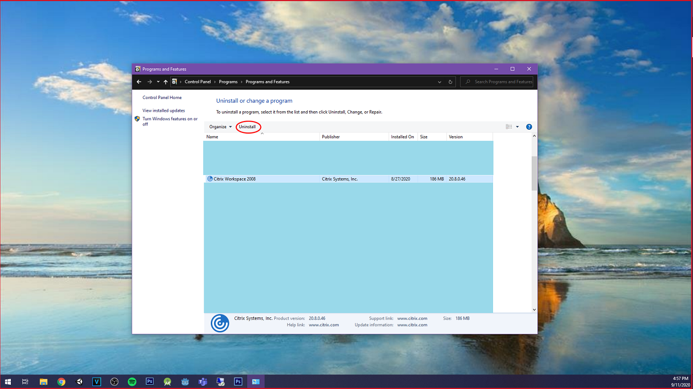
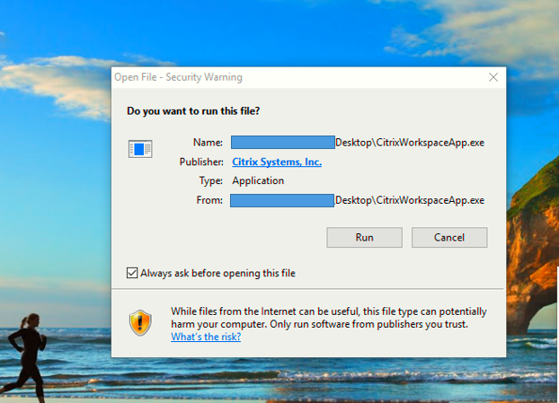
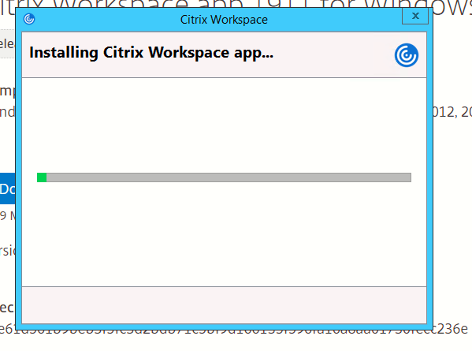
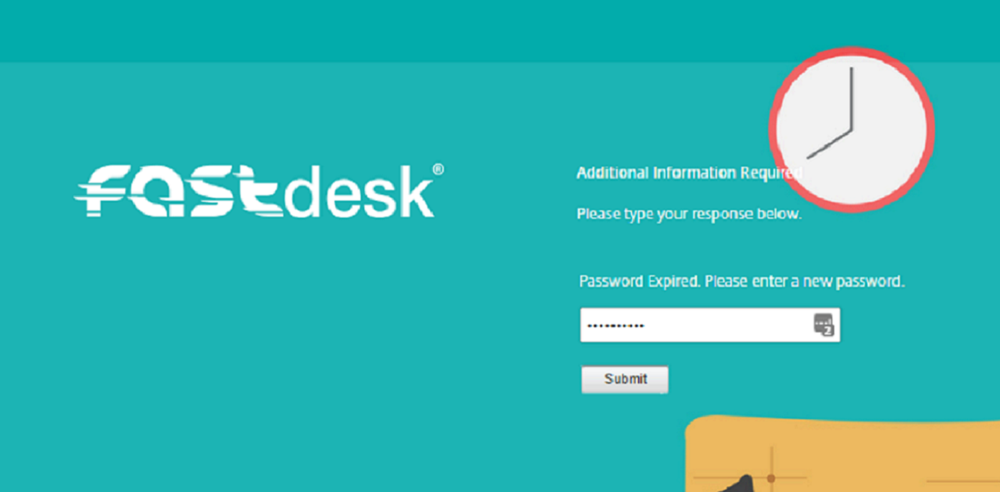
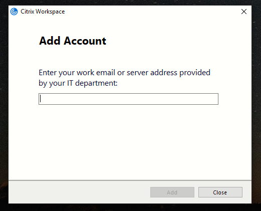

# How to update Citrix Workspace on a Windows Device

The Citrix Workspace application acts as a receiver for your desktop and provides you with high-performance access from anywhere around the world via an internet connection. The Citrix Workspace application is made by Citrix and is frequently updated by Citrix. With each new update comes an improvement in security, stability and overall performance. This guide provides a step-by-step guide to updating the Citrix Workspace application.

```eval_rst
.. note::

   UKFast recommends that each FastDesk end-user updates their Citrix Workspace application as soon as an update is released.
   
```

## Step 1 - Uninstalling the Citrix Workspace Application

To update the Citrix Workspace Application on your local computer, you must first uninstall the older version of the Citrix Workspace Application.

To do this, ensure you are **outside** of your FastDesk session. In the bottom left corner of your deskop, click the Windows icon and type `Control Panel` in the search bar. This will bring up the search bar and you will see `Control Panel` appear as a search result. Click this to open *Control Panel*.  Please refer to **image** below for a visual representation. 



Once Control Panel is open, you will see a list of options as displayed in **image** below. From here, please select `Uninstall a program`. 



This will bring you to the Uninstall or change a program page. From here, find and select `Citrix Workspace` or `Citrix Workspace Application`. Next, click `Uninstall` as highlighted in **image** below.     



## Step 2 - Downloading the latest version of the Citrix Workspace Application

From your Windows local PC, download and install the latest version of the Citrix Workspace app at this URL:
`https://www.citrix.co.uk/downloads/workspace-app/`. Alternatively, you can click this [link here](https://www.citrix.co.uk/downloads/workspace-app/) to take you to the website. All versions of Workspace should be listed here.

Expand the `Workspace app for Windows` section and select the latest version of the "Workspace app for Windows". This takes you to the download link where you can download the application (See **image** below).

")

Once the file has downloaded, open the file to begin installation. You might get a security warning asking `Do you want to run this file?`. Check that the `Publisher` identifies as "Citrix Systems, Inc." before selecting Run (Refer to **image** below).




## Step 3 - Re-installing the Citrix Workspace Application

Follow the installation dialog box to finish with the installation of the workspace app ( **Image** below provides a visual representation).




Once the "Citrix Workspace" application is installed, open your web browser and navigate to the Following URL `“https://www.fastdesk.co.uk”`. On this step, it is vital that you enter the full URL including the `"www"`. Alternatively, you can click this [link here](https://www.fastdesk.co.uk) to take you to the website. In terms of browsers, the web portal is compatible with the latest versions of Google Chrome, Mozilla Firefox, Microsoft Edge and Internet Explorer.


Once here, you will see the FastDesk branding and a log in page with a man on a sofa (Refer to **image** below). 


Go ahead and enter the username and password credentials that were provided to you by the FastDesk team. Upon entering your credentials, you will be asked to change your password (See **image** below). 



```eval_rst
.. note::

   Your new password must be a minimum of 8 characters in length and contain at least 3 of the following: uppercase letters, lowercase letters, numbers, symbols and special characters e.g “! ” £”. Your password can also not contain the name of your account. For example, if your account name is John Smith, a password with the word ‘john’ will not be accepted. Once your password has been reset, it should simply log you in. It may ask you to dectect receiver, if so, simply select the option that allows it to detect the receiver.
   
```

## Workspace Application Log in setup (Optional)

Although it is recommended you access FastDesk through the URL, you can also access your desktop through the Citrix Workspace Launcher. If you prefer to login directly to the Citrix Workspace app, you can do so. Simply click your windows start menu button and search for "Citrix Workspace Application". After launching the Citrix Workspace app, you will be asked to add an account. See **image** below.



Simply type the following URL `"https://www.fastdesk.co.uk"` and click Add. Alternatively, enter the URL that has been provided to you by the FastDesk team if you have a private FastDesk. You will then be prompted to enter your username and password into the application. See **image** below.


```eval_rst
.. warning::

   Whenever you log out of a desktop, do allow at least 3 minutes before attempting to log back in. This is to ensure the session correctly ends before another one is open. If you have not waited long enough, there is a danger of your applications not appearing when you log in. If you do find that this is the case, simply log out, wait at least 3 minutes and log back in again.
   
```

**_This instruction guide should assist you in getting logged in for the first time. If you have any questions or still require assistance, please contact the FastDesk support team on 0800 923 0617_**.

 ```eval_rst
   .. meta::
      :title: Guide to updating the Citrix Workspace Application | UKFast Documentation
      :description: Guide for users on how to update their Citrix Workspace Application
      :keywords: FastDesk, Citrix, ukfast, VDI, Citrix Receiver, Windows, Workspace Application 
