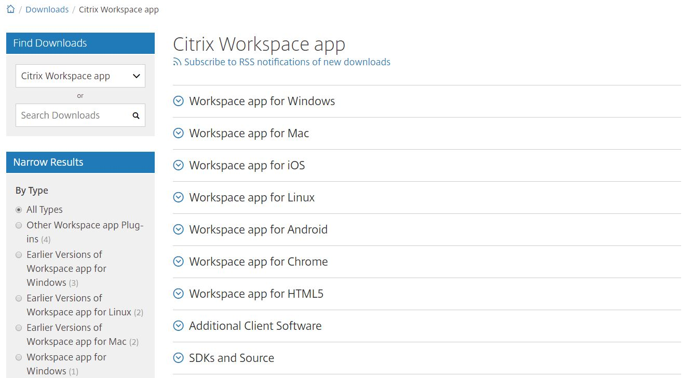

# FASTdesk Getting Start Guide

FASTdesk®  is UKFast’s Desktop as a Service (DaaS) solution, which allows users and organisations to work more effectively and securely by giving access to files, applications and desktop items remotely via an internet connection. All desktop settings and files are stored remotely in the cloud, providing cross-device compatibility and eliminating the risk of data loss by removing the risk of unauthorised access. This DaaS solution allows users to work in the same way they would with a traditional local desktop, but increase the flexibility with which they do so.

# Step 1 - Installation

From your device, download and install the latest version of the Citrix Workspace app at this URL:
https://www.citrix.co.uk/downloads/workspace-app/

As you can see from the image below, all versions of Workspace are listed. Expand the section relative to your operating system and install the app.

Mobile versions of the app can be accessed via the above link or preferably, through your devices' app store (e.g. Apple’s
App Store or Google Play Store for Android)

 

# Step 2 - Logging in

From your preferred browser, log in via the URL: https://www.fastdesk.co.uk using the username and password provided.

After you have successfully logged in for the first time, you will be asked to change your password. Your password must be a minimum of 8 characters in length and contain at least 3 of the following: uppercase letters, lowercase letters, numbers, symbols and unicode characters that are deemed as alphabetic characters but not uppercase or lowercase. Your password can also not contain the name of your account. For example, if your account name is John Smith, a password with the word 'john' will not be accepted. 
