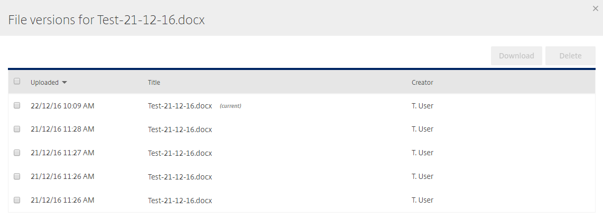
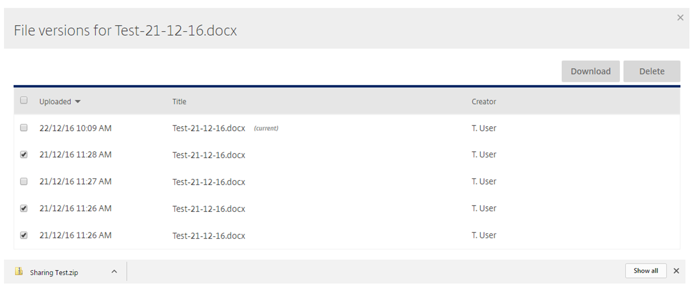
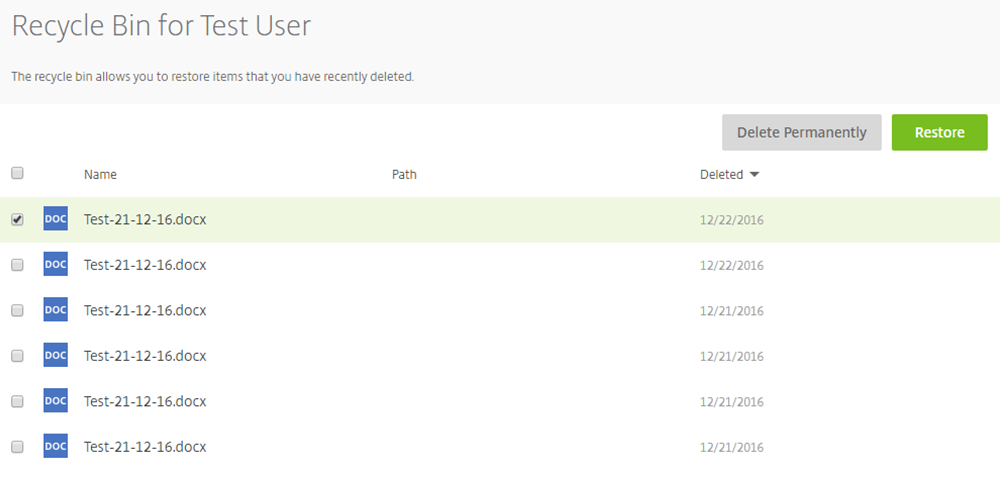

# Accessing previous versions of your files

File versioning is enabled so that you can roll back to the previous 5 versions of a file. This can be very useful if your file corrupts or if you wish to give another user an older version of a file.

Previous versions of files can be accessed via the FASTdrive web app. Here, you'll be able to see the previous 5 versions, when they were saved, and who they were saved by.

Firstly, log into your FASTdrive web app using your user credentials. Once you've logged in, navigate to the folders tab. Here, you'll see 3 different folders that you can navigate to; Personal Folders, Shared Folders, and Favourites.

Choose one of the above top-level folders and navigate to the document that you'd like to see the previous versions of.

If you look to the right of the file name and the file upload time, you will see a small blue icon. As you can see, this icon does not appear beside every file. If only one version of a file can be found, the icon will not be shown and you won't be able to view previous versions.

Clicking the blue icon will show you the previous version(s) of this file. In this instance, you can see that there are 5 versions (including the current version).

You can see exactly when the document was saved and which user made the changes. Also, you can download or delete individual versions by checking the tick box to the left of the upload time.

Additionally, versions before the ones listed above will be moved to the recycle bin. Files from the recycle bin can be restored and added to the versions list so that they can be downloaded. However, files do not stay in the recycling bin forever and will only be stored here for a maximum of 45 days.

As you can see below, there are versions of the file above which are in the recycling bin.

I have selected one of the files above and I have the option to either delete the file permanently or I can restore the file which will mean that it will be shown as a previous version.

In this instance I have restored the file and as you can see there are now 6 previous versions of the file (including the current version). The version which I restored is the version saved at 11.25am.

