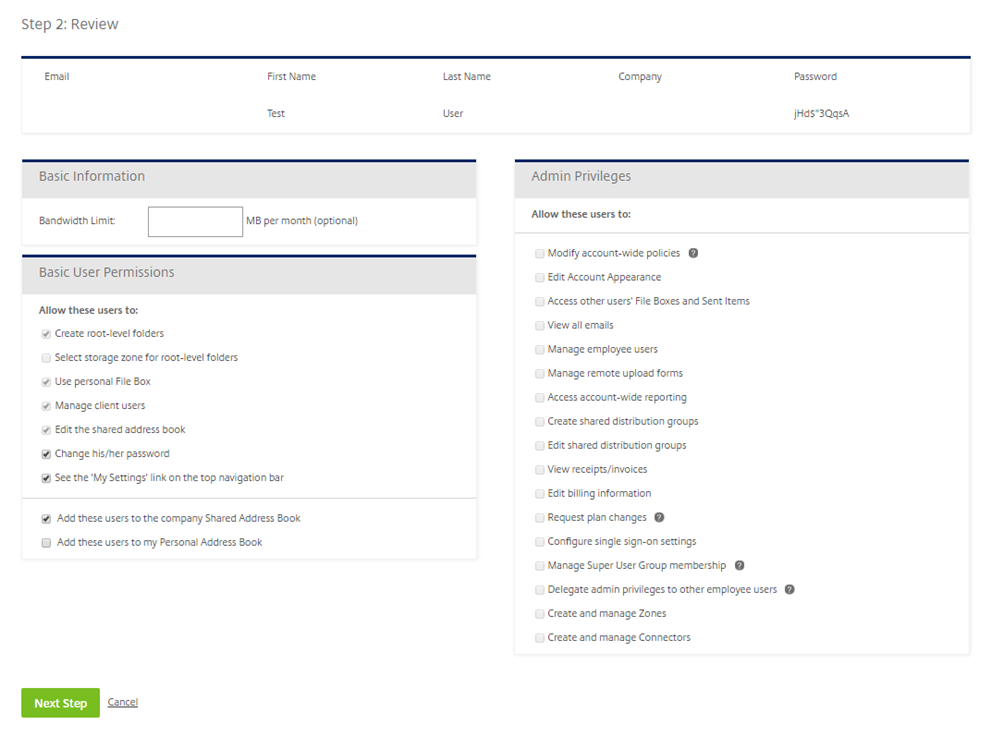

# Adding an employee from an Excel spreadsheet

Instead of adding employee users manually one-by-one, multiple employees can be added by using an Excel spreadsheet to speed up the process. To do this, again navigate to __People__ and then __Browse Employees__. Click __Create Employee__ and you will see this button:


The following screen will then appear which explains how the process is carried out. There is a link to a template spreadsheet which shows how the spreadsheet needs to be structured before being uploaded. The below image also contains instructions on how to export your Outlook contacts if you wish to use some of them in FASTdrive.


If you copy the headers into your own spreadsheet you can then input your own data. Note: The headers must not have spaces in between words and the company field doesn't have to be filled in. The password field can also be left blank if preferred and a password will be automatically chosen.

Click __Choose File__ then upload your Excel file. Once uploaded you should see a table like the one below. This should contain the data which you have stored in your Excel spreadsheet.



You will need to provide the user with some basic user permissions. __Select storage zone for root-level folders__ will be set as unticked by default because this is automatically set to our storage zone. Also, __Create root-level folders__, __Use personal File Box__, __Manage client users__, and __Edit the shared address book__ will be set as ticked by default. However, the admin user can choose whether the employee user can change his/her password and whether they can see the __My Settings__ link on the top navigation bar. Furthermore, you can also choose whether to add this user to the shared company address book and the address book from which you are creating the account.

We recommend that __Add this user to the shared company address book__ is ticked. This is so that the user can be seen by other users on the platform and share files with them.

The following describes the permissions and what they do:

__Create-root-level folders__ – This will give a user permission to create top level folders.

__Use personal File Box__ – This will give a user permission to use their file box.

__Manage client users__ – This will give the user permission to add client users.

__Edit the shared address book__ – This will give user's permission to edit the users within the shared address book.

__Change his/her password__ – This will give the user permission to change their password.

__See the 'My Settings' link on the top navigation bar__ – This will allow the user to see this button.

__Add this user to the shared company address book__ – This will add the user to the shared address book which is seen by all employee users.

__Add this user to my address book__ – This will add the user to your personal address book but not to other users address books.


Once permissions have been set, you will have the option to send out confirmation emails. This lets the new user know that they have been added to FASTdrive.

```eval_rst
   .. title:: FASTdrive | Adding an employee from an Excel spreadsheet
   .. meta::
      :description: Detailed guidance on adding employees using an Excel sheet
      :keywords: ukfast, fastdrive, excel, administration, user management
```
