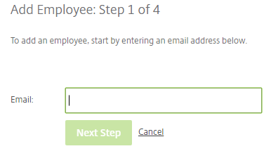
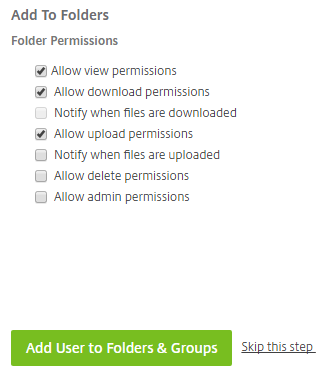
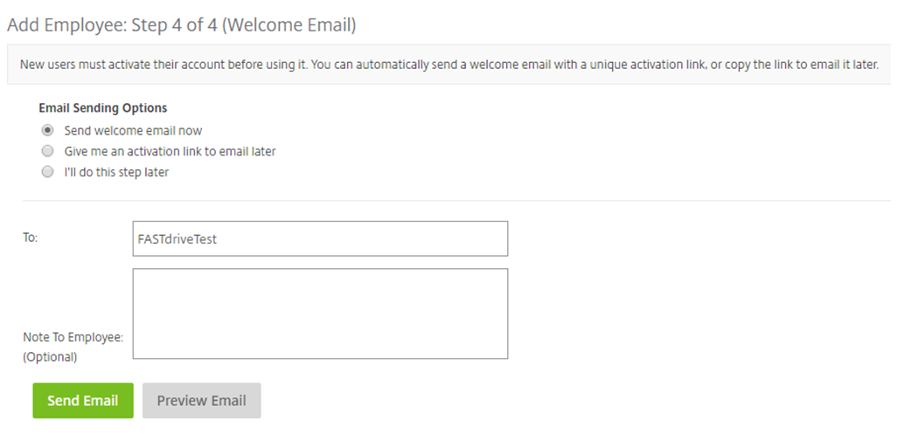
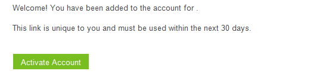
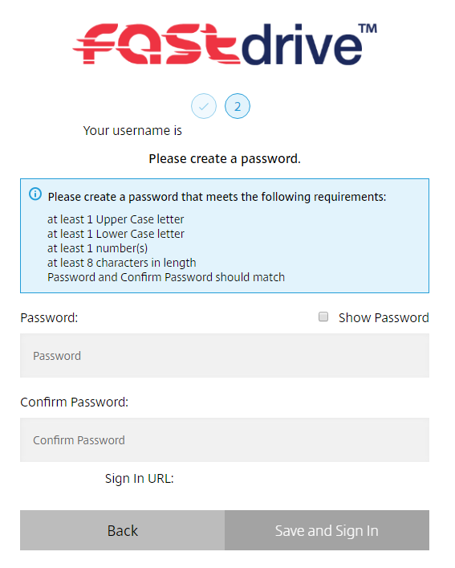

# Adding an employee manually

The admin user has permissions to create employee accounts on the system. The below is a tutorial on how to do this.

## Step 1

Firstly, navigate to the __People__ tab which can be seen on the left-hand side of each page. Clicking here will expand the menu and here you will be able to see a variety of options. In order to create an employee, you want to choose __Browse Employees__. Then, you want to click the green __Create Employee__ button which can be seen on the right-hand side of the page.


## Step 2

Next, you will need to provide the user's email address, which will be used as their username to log into FastDrive.



## Step 3

The next step involves you entering some basic information. Firstly, you will need to fill in basic details such as Name and Company.

The password field will be automatically filled in as you can see below but you can change this if you wish. However, take note that the password will not be starred out and will appear on the screen so this isn't particularly recommended. Instead, you can change the password after the account has been created.


You will also need to provide the user with some basic user permissions. __Select storage zone for root-level folders__ will be set as unticked by default because this is automatically set to our storage zone. __Create root-level folders__, __Use personal File Box__, __Manage client users__, and __Edit the shared address book__ will be set as ticked by default. However, the admin user can choose whether the employee user can change his/her password and whether they can see the __My Settings__ link on the top navigation bar. Furthermore, you can also choose whether to add this user to the shared company address book and the address book from which you are creating the account.


We recommend that __Add this user to the shared company address book__ is ticked. This is so that the user can be seen by other users on the platform and share files with them.

The following describes the permissions and what they do:

__Create-root-level folders__ – This will give a user permission to create top level folders.

__Use personal File Box__ – This will give a user permission to use their file box.

__Manage client users__ – This will give the user permission to add client users.

__Edit the shared address book__ – This will give user's permission to edit the users within the shared address book.

__Change his/her password__ – This will give the user permission to change their password.

__See the 'My Settings' link on the top navigation bar__ – This will allow the user to see this button.

__Add this user to the shared company address book__ – This will add the user to the shared address book which is seen by all employee users.

__Add this user to my address book__ – This will add the user to your personal address book but not to other users address books.

## Step 4

Next you can choose to add employee users to folders and groups. Here you can choose specific folders and can choose from a variety of permissions. Likewise, you can add users to a distribution group which means that they will gain access to any folders which the group has permission to use.




You can set up folder permissions after you have created the user unless you are adding a user to a distribution group. You can navigate to individual folders and set permissions by navigating to the __People on this Folder__ tab.

Step 5:

The final step is to send the user a welcome email so that they can activate their account.



Below is a snippet of the email that you will receive:



The user will then be asked to confirm their personal information.


You will then be asked to reset the password for the account and once you've done this you will be successfully logged in.



```eval_rst
   .. title:: FastDrive | Adding An Employee Manually
   .. meta::
      :title: FastDrive | Adding An Employee Manually | ANS Documentation
      :description: Guidance on adding an employee to FastDrive manually
```
