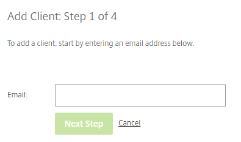
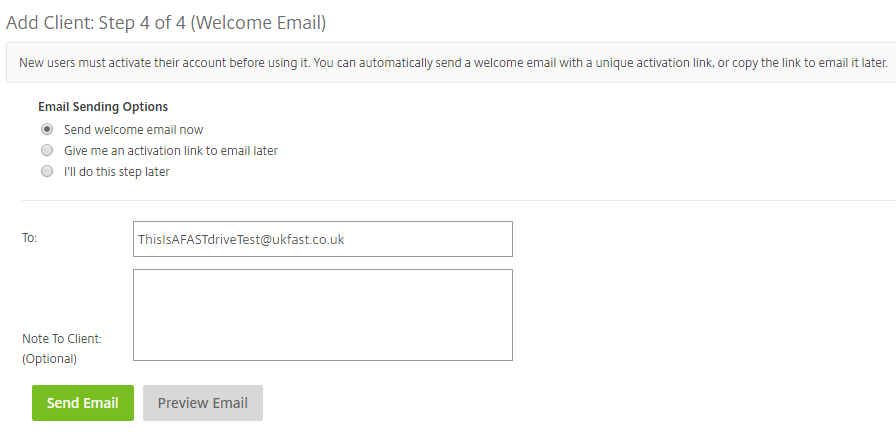

# Adding Client users

Client users can be added by any employee user as long as they have the relevant permissions enabled on their account. In order to add a client user, the __Manage Client Users__ permission must be enabled.

A client user doesn't have the same permissions as employee users and therefore doesn't require a license.

## Step 1

Firstly, navigate to the __People__ tab which can be seen on the left-hand side of each page. Clicking here will expand the menu and here you will be able to see a variety of options. In order to create an employee, you want to choose __Browse Clients__. Then, click the green __Create Client__ button which can be seen on the right-hand side of the page.


## Step 2

Next, in order to add a client, you need to enter their email address. This will be used in order to sign into FastDrive as a client user.



## Step 3

Next, you need to enter some basic information and set some basic user permissions. As you can see, client users have much less access to the platform compared to employee users.


## Step 4

Similarly to how employee users are added to folders and groups, the same also applies to client users too. The employee user who is adding the client user can assign the client user to folders and distribute various permissions.

In order to add a user to a folder, expand one of the 3 main folders (Personal Folders, Shared Folders, and Favourites) and choose a folder which you'd like to add the client user to by marking the check box.


Once folder permissions have been distributed, the next stage is to send a welcome email to the new client user which allows them to activate their account.



```eval_rst
   .. title:: FastDrive | Adding Client Users
   .. meta::
      :title: FastDrive | Adding Client Users | ANS Documentation
      :description: Guidance on adding client users to FastDrive
```
