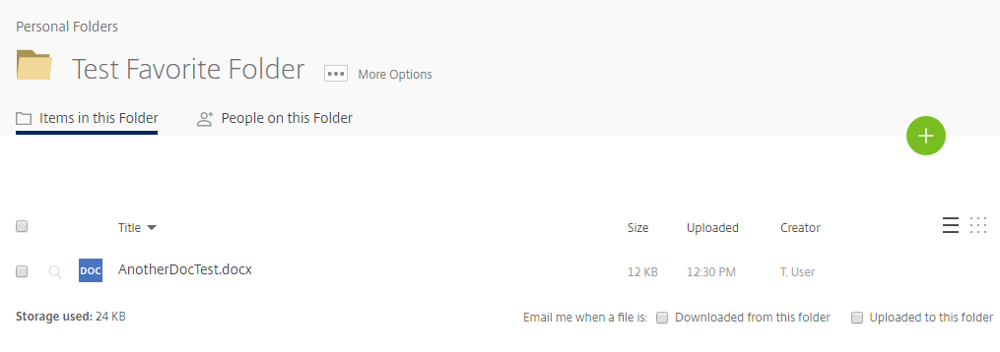

# Adding folders to your favorites

You may have thousands of folders stored within your __Personal Folders__ on FASTdrive but it may be the case that you only access a dozen or so of these folders on a regular basis.

So that you don't have to scroll through all of these folders every time you wish to access them, folders can be added to your __Favorites__ so that they can be easily accessed.

To mark a folder as a favorite, click the star to the left of a folder's name.

This will create a shortcut to the folder in __Favorites__.

Clicking this folder will open the folder in its original location under __Personal Folders__.

