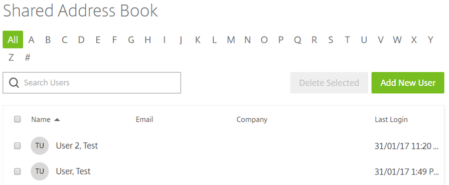
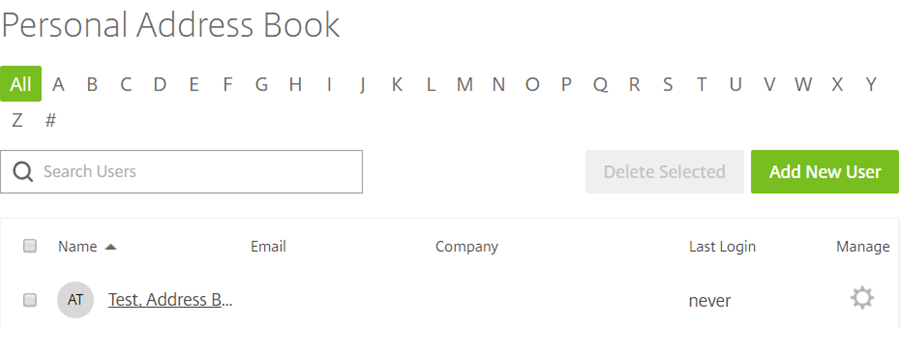

# Address books

```eval_rst
   .. meta::
      :title: FastDrive | Addressbooks | UKFast Documentation
      :description: Information on how to use addressbooks in FastDrive

```

There are 2 different address books available in FASTdrive; the __shared address book__ and the __personal address book__. When you are creating an employee account, you will have the option to add the user to one of, or both of these address books.

The __shared address book__ contains contacts which are visible to all employee users. The shared address book is useful because it allows your employee users to easily send files and messages to each other. All employee users can add users to the shared address book and you can also add client users here as well as employee users. However, only employee users will be able to see this address book as client users will be prevented from seeing this due to their permission settings.



If a user is only added to your __personal address book__ it will mean that __only you__ will be able to see that contact. Client users can be added to your personal address book but will not have access to a personal address book of their own.



For the most part, you will be using your address book when you are sharing files with other users. For a detailed walkthrough on how to
share files, [click here](/desktop/fastdrive/sharingfiles.html)

