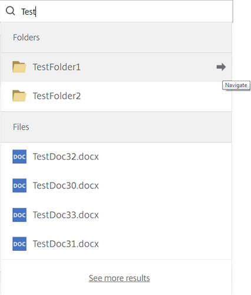

# Is there a way I can browse for a specific file or folder?

You may encounter an issue where you can't find one of your files or folders. This may be because you haven't accessed it for a while and can't remember exactly where it is located.

If this is the case, you can directly search for a file or folder using the search function in the FASTdrive web app.

At the top of every page you will see a small magnifying glass. Clicking this icon will expand the search box.


In this box, enter the name of the file or folder that you'd like to search for. You don't have to enter the full name of the file or
folder here as the search will bring up all results containing the consecutive characters that you have entered.

In this instance I have entered __Test__ into the search bar and as you can see, a variety of files and folders have appeared which match the string of text that I entered.


If you hover over one particular file or folder, you'll be able to see a few shortcuts which are related to the file or folder. From here, you can directly navigate to a file, share a file, or download a file.


Likewise, you can also navigate directly to a folder from this view.



If the file or folder that you are looking for doesn't appear whilst you are searching, hit the __enter__ key to perform a full search. This will perform a search on all the files and folders that you have permission to see and will return anything that matches your search.


If you have the relevant permissions on your account, you will be able to see other users' files. In order to narrow this down to a particular user, enter the user's email address in the __Created By__ field. Your search results can also be narrowed down to a particular date by changing the __Upload Date__ to your preference and you can also narrow the results down to a particular type of content, whether that be a file or a folder by choosing a particular __Content Type__. Finally, if you know the whereabouts of the file or folder that you are looking at, you can also state this by changing the __Folder Location__.


```eval_rst
   .. title:: FASTdrive | Browsing for files
   .. meta::
      :description: Guidance on browsing for files
      :keywords: ukfast, fastdrive, files, browsing
```
