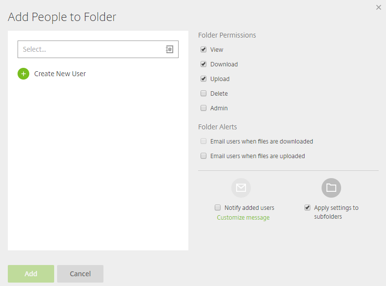

# Creating Folders in FastDrive

Primarily, folders are created within the FastDrive web app. In order to create a folder, navigate to either your __Personal Folders__ or your __Shared Folders__. If you navigate to your __Personal Folders__ you will see the following screen. Of course, if you already have some files here, they will be listed.

In the image above, you should be able to see a green circular icon.

If you hover over this icon, a variety of options will appear as shown below:

In order to create a folder, you want to choose __Create Folder__. Once you have done this, the following screen will appear.

This requires you to enter the name of the folder and you can also add a description of what is in the folder if you like. You also have the option to add people to the folder right away or you can do this after the folder has been created.

If you don't decide to add people to the folder right away, you will see a screen similar to the one below.

However, if you do decide to add people to the folder, you will see the following:

You can add a user to the folder by entering their name if they are already in the address book, or by creating a new user. On the right, you can adjust the folder permissions to what you deem necessary.

### Note: You can't assign different permissions to different users in this view. For example, if you're adding 3 users but only wish for 1 user to have upload access, configure these permissions after you have created the folder.

Once users have been added, you can see their permissions by clicking __People on this Folder__.

Below, are the users that have been given permissions and you can see the permissions that they have.

