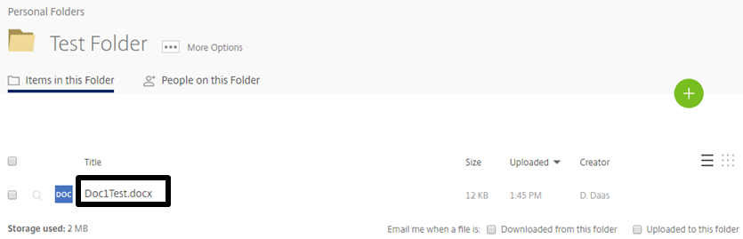
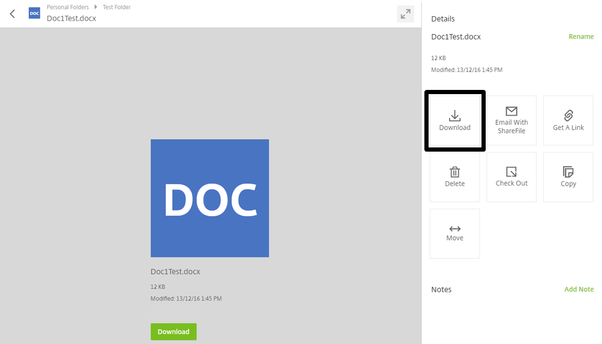
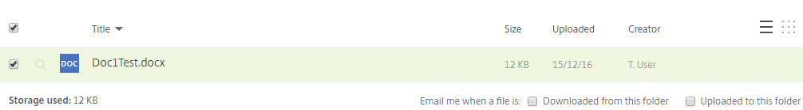

# Downloading Files

Files can be downloaded from FastDrive in order to be used locally. Firstly, navigate to the folder where the file that you'd like to download is situated.

Once you have found where your file is located, you need to left-click the file name.

Completing this action will bring up a variety of options. However, in this instance we're looking at how to download the document. On the right-hand side amongst the other options you'll be able to see a button named __Download__. Clicking this will download the document.

Once you've hit the __Download__ icon, at the bottom of your screen you should see that the file is downloading or already has been downloaded. Left click the file in order to open the document locally.

Files can also be downloaded without opening the file preview screen. Instead of left-clicking the name of the file which you would like to download, check the tick-box to the left of the file name as shown below.

Above this, you'll be able to see a variety of actions which you can undertake. One of these actions is to __Download__ the file(s) which you have selected. Click this button and the file will download as normal.

