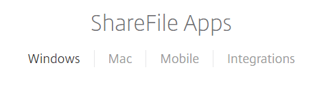
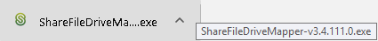
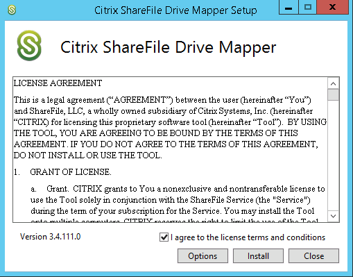

# Installing Drive Mapper

As well as using the web app to manage all of your FastDrive files, there are also a variety of different applications which can be downloaded to integrate with FastDrive.

The application that we recommend the most is Drive Mapper. This, along with the other applications can be downloaded by logging into the web app using your personal credentials.

In order to access these applications, click the __Apps__ link which appears in the top-right hand corner of each page.


Here you'll see a variety of apps for different platforms, whether that be Windows, Mac, or Mobile.



Click the __Windows__ tab and you will see a variety of applications. In this instance, we want to download Drive Mapper, which is only available on Windows.


If you left-click __Learn More__ you can get some more information on Drive Mapper, including the Windows platforms that it supports. If you navigate back to FastDrive you will have the option to download Drive Mapper to your local device. Left click __Download__ to start the process.

As soon as you hit download, you will be able to see the progress in the task bar. Left click the executable file to start the installation process.



You'll need to accept the license terms and conditions before running the installer. Give this a read through and if you accept the terms check the tick box and click __Install__.



Once finished, you'll see the following screen. If you click __Launch__, Drive Mapper will load for the first time.


To login to Drive Mapper, use your FastDrive credentials. Take note that only employee users can log in and use Drive Mapper.


```eval_rst
   .. title:: FastDrive | Installing Drive Mapper
   .. meta::
      :title: FastDrive | Installing Drive Mapper | ANS Documentation
      :description: Installing Drive Mapper for FastDrive
      :keywords: ukfast, fastdrive, files, folders
```
