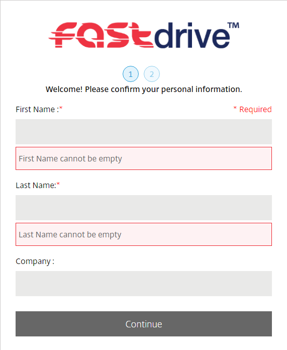
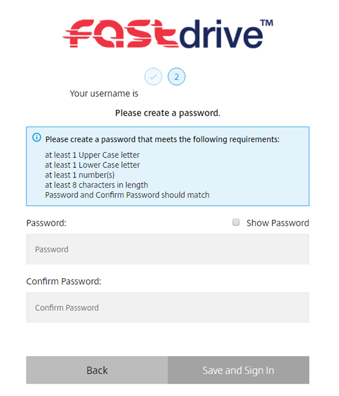
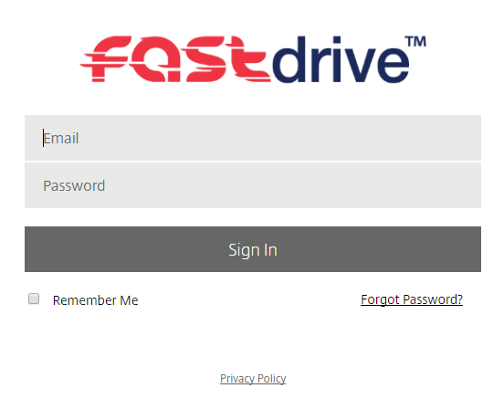

# Logging into FastDrive

## First-time login

Before you log in for the first time, you will need to navigate to the email account which is associated with your FastDrive account in order to activate your account.

You will see an activation email which looks similar to the below:


If you click __Activate Account__, you will be directed to a page where you'll be prompted to enter some personal details and a new password.





Once you have run through these steps you will be automatically signed in.

## Standard login

To login, you need to navigate to your unique FastDrive URL. This will be sent to you in a ticket along with your FastDrive admin user credentials.

Once you have run through the first time login process, you can login every time by entering your email address and password.

Below is an image of the standard log in screen that you will see. If you enter the correct credentials you will be successfully logged in.




```eval_rst
   .. title:: FastDrive | Logging into FastDrive
   .. meta::
      :title: FastDrive | Logging into FastDrive | UKFast Documentation
      :description: Information about logging into fastdrive
      :keywords: FastDrive, Citrix, ukfast, ShareFile, Citrix Files, Data, Storage, Encryption
```
