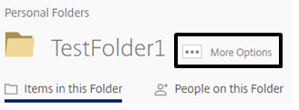
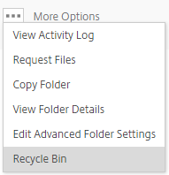

# The FastDrive recycle bin

The FastDrive recycle bin contains files and folders that have been deleted from your account. Files that have been deleted and therefore
moved to the recycle bin will stay there for a maximum of 45 days. It's not possible to recover a file 45 days after it was originally
deleted and if you permanently delete a file from the recycle bin before the end of this 45 day period, it cannot be recovered.

To access your recycle bin, expand the __Folders__ section of your left hand menu. Here, you'll see a link named __Recycle Bin__. Click this in order to launch your recycle bin.

Here, you'll be able to see a list of folders and files which you have deleted.

You can restore files and folders from the recycle bin or delete them permanently. Be aware that once you've permanently deleted an item, you will not be able to recover it.

As noted above, files and folders will be stored here for a maximum of 45 days and it's not possible to recover a file once this 45 day period has passed.

## Folder recycle bins

Each folder has a recycle bin which will show your recently deleted items. To access a folder's recycle bin, navigate to that particular folder.

Once you are in that folder, you'll be able to see an ellipsis entitled __More Options__ next to the folder name as shown below.

Hover over the above icon and a variety of options will appear. One of these options will be entitled __Recycle Bin__.

Click this icon and you'll be directed to the recycle bin for this folder.

Exactly like the standard recycle bin, files and folders can be permanently deleted or restored from this view.
