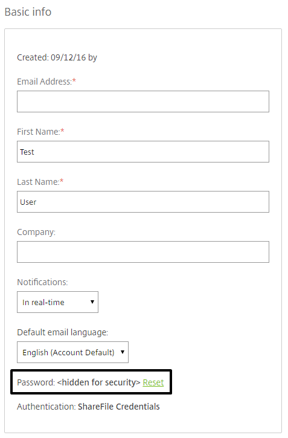
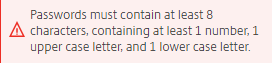
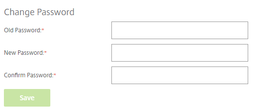
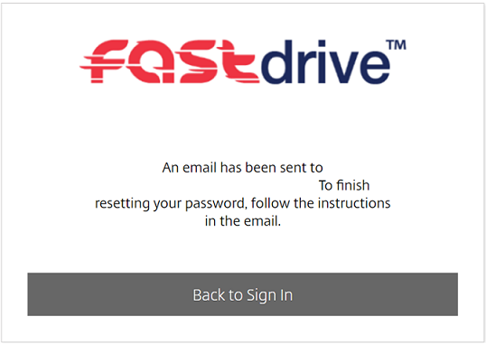
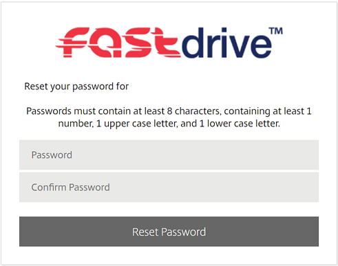

# How to Reset a FastDrive Password

If you have forgotten your FastDrive password, you have the ability to be reset your own password. To do this:

* Open an internet browser and input your companies FastDrive domain this should look like `companydomain.sharefile.eu` if you are unsure on how to access your domain or have any further issues at this stage please contact our support team (`0800 923 0617`).

* Once you have entered your domain you will be prompted with a log in page similar to the one shown below:  


* Please enter the email address associated with the account that cannot be accessed and select `Forgotten Password?`.


* You will then be asked to verify that you are not a robot. Please proceed with the capcha form if prompted.


* Once the above has been completed and verified, the user will be prompted with the confirmation screen below:


This confirms that an email has been sent to the user. This email will be sent from share-support@ukfast.co.uk and will contain a password reset link.  Please proceed with the steps. 

If the user does not receive an email, please contact UKFast support.
```eval_rst
.. title:: FastDrive | How to Reset a FastDrive Password
.. meta::
:title: How to Reset a FastDrive Password | UKFast Documentation
:description: How to Reset a FastDrive Password
:keywords: fastdrive, password, reset, citrix, guide, tutorial

## Resetting employee user passwords as the Admin user

The admin user can reset the password of any employee user. To do this, navigate to the __People__ tab and click __Browse Employees__.


Here, you will see all of the employee users which are on the platform. Select the employee user whose password you'd like to reset by marking the tick box as shown below and then left clicking their name.


From here you'll be able to see the __Basic info__ section and you'll see an option to reset the user's password.



By clicking reset, you will be able to enter a password for the user and you'll see the password requirements that you need to adhere to.


Once you've entered the password, hit the __Save Changes__ button to change the password.


Once the password has been changed and the user can log in, they can then change the password to something of their choice. To do this, the user needs to click __Personal Settings__ on the left-hand menu.


The user wants to then click __Edit Profile__ on the following page.


If the user scrolls down the page, they'll be able to see a __Change Password__ header. Under this, the user needs to enter their current password and their new password twice. Once the user has entered their password they should click __Save__. As long as the password meets the necessary requirements, it will be changed.





## Resetting your own password as a normal employee user

Employee users can reset their own passwords as long as the __Change his/her password__ permission is selected under __User Access__.

Firstly, the user needs to navigate to the left-hand menu and click __Personal Settings__.


The user wants to then click __Edit Profile__ on the following page.


If the user scrolls down the page, they'll be able to see a __Change Password__ header. Under this, the user needs to enter their current password and their new password twice. Once the user has entered their password they should click __Save__. As long as the password meets the necessary requirements, it will be changed.


If you have forgotten your password, you won't be able to follow the above method. Instead, you can follow the method below.

Firstly, navigate to your FASTdrive web app log in screen. This should look similar to the below.


You will be able to see a __Forgot Password?__ link. Click this link and the following screen will appear. Enter your email address and select the specified icon and click __Send__.


You'll then be notified that an email has been sent to your registered email address.



You'll see an email in your inbox similar to the one below. Click __Reset your password now__.


You will then be directed to a screen similar to the one below. Here, enter your new password twice and click __Reset Password__.



You will then be notified that the password has been reset successfully. Click __Back to Sign in__ and enter your new credentials.


