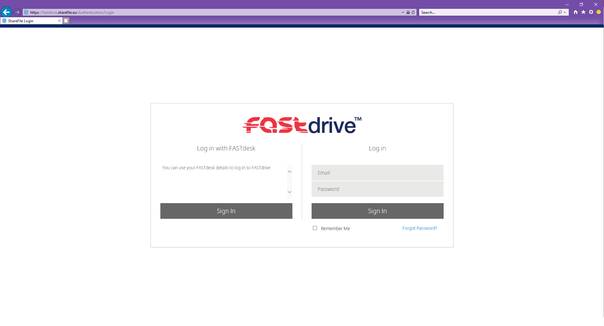
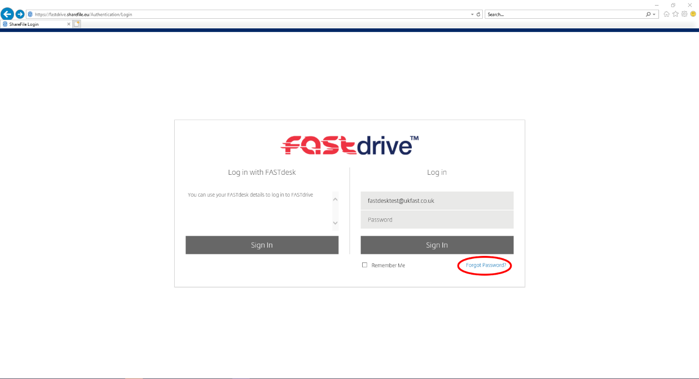
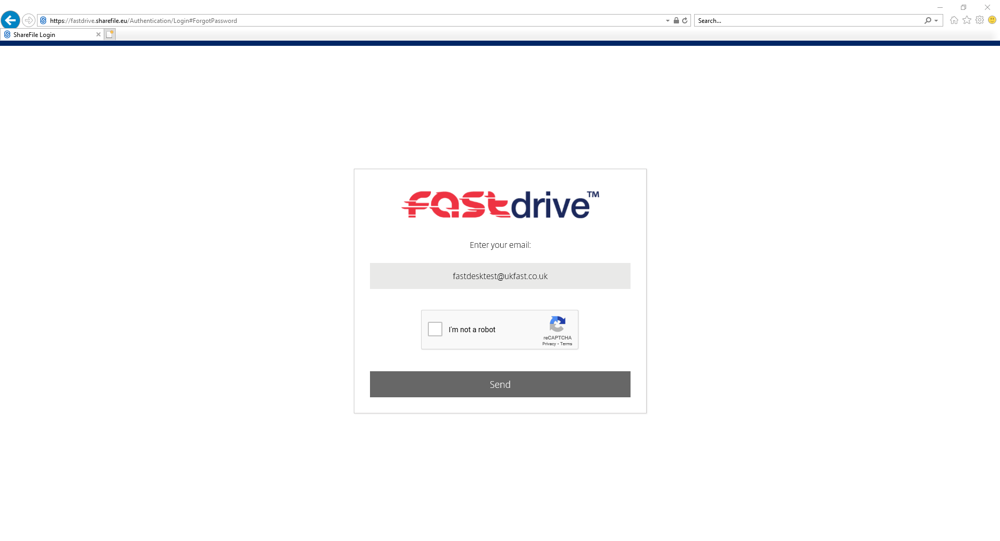
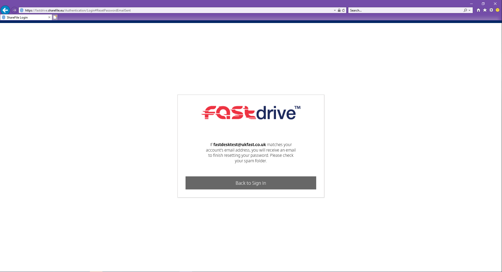

# How to reset your FastDrive Password

If you have forgotten your FastDrive password, you have the ability to be reset your own password. To do this:

Open your internet browser and browse to your company's FastDrive domain. This should look like `companydomain.sharefile.eu`. If you are unsure of how to access your domain, please contact the primary contact on your account with UKFast.

Once you have entered your FastDrive domain, you will be prompted with a login page similar to the one shown in the image below 



Please enter the email address of the account that cannot be accessed. From here, click `Forgotten Password?`.



You will then be asked to verify that you are not a robot. Please proceed with the captcha form if prompted.



Once verification is complete, you will be prompted with the confirmation screen as displayed below:



This confirms that an email has been sent to the user. This email will be sent from `sharefile-support@ukfast.co.uk` and will contain a password reset link.  Please proceed with the steps instructed. 

If the user does not receive an email, please contact UKFast support.

**_This instruction guide should assist you in resetting your FastDrive password. If you have any questions or still require assistance, please contact the FastDesk support team on 0800 923 0617_**.

 ```eval_rst
   .. meta::
      :title: How to Reset a FastDrive Password | UKFast Documentation
      :description: Guide for users on how to reset their FastDrive Password
      :keywords: fastdrive, password, reset, citrix, guide, tutorial, citrixfiles
