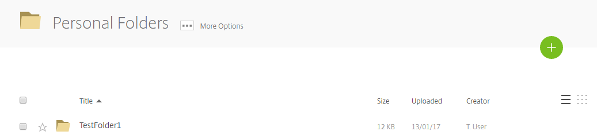
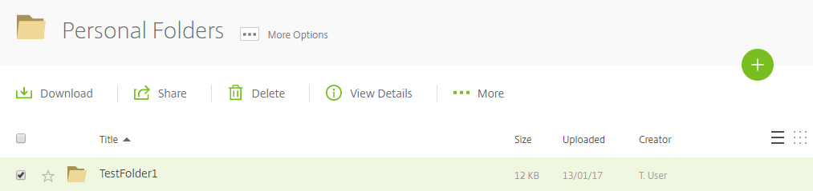
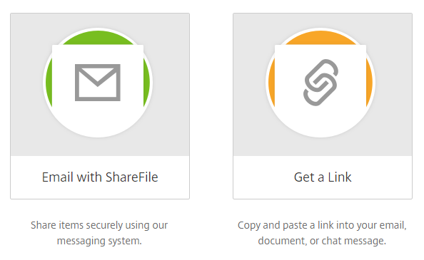
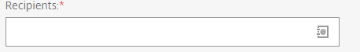
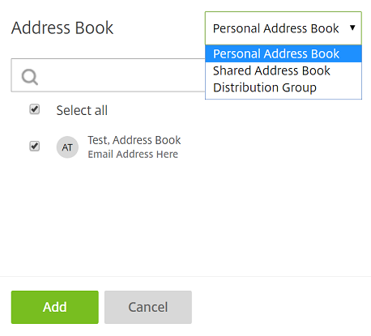
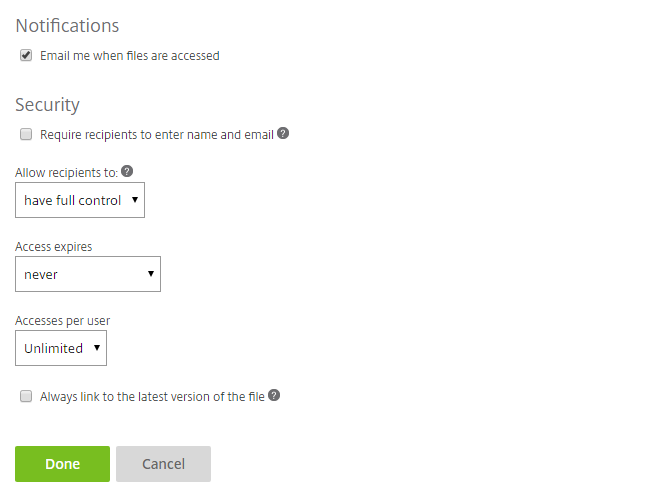

# Sharing files

```eval_rst
  .. title:: FastDrive | Sharing Files
  .. meta::
    :title: FastDrive | Sharing Files | UKFast Documentation
    :description: Information on how to share files in FastDrive    
```

In FASTdrive, you can share files and folders so that other people can access them. You can share files and folders with both FASTdrive users and non-FASTdrive users via the sharing feature that is available within FASTdrive.

In order to share a file with someone else, firstly navigate to that file within the FASTdrive web app. In this instance I have delved into my personal folder so that I can share a folder named __TestFolder1__.



To the left of the folder name, there is a checkbox so that you can select this folder. Tick this box and you will see a variety of options that are available to you. In this instance, we want to share this file, so click the __share__ button.



Two options will then appear; __Email with ShareFile__ and __Get a Link__. These are two different ways of sharing files.

__Email with ShareFile__ is more useful when you wish to share files with other FASTdrive users.

__Get a Link__ is more useful when you wish to share files with users that don't have FASTdrive.



Firstly, we'll go through __Email with ShareFile__.

Once you've clicked __Email with ShareFile__, you'll see the following screen.


As you can see, the folder that you initially shared is shown in the top right-hand corner of the screen. On the left, you need to enter the __Recipient(s)__ of the message, the __Subject__ of the message, and if you like you can add an additional __Message__.

Firstly, we need to choose who we are going to send the message to. In the recipients field, there is a small icon as you can see below.



If you click this icon, your address book will open. This will contain all of the contacts that have been added to either your Personal Address Book, Shared Address Book, or one of your Distribution Groups.



Click __Add__ to confirm that you wish to add the user(s) to the message.

Following this, enter a subject (this is mandatory) and if you like, enter an additional message.

Below this, you will be able to see an icon named __Edit Message Options__


As you can see below, various options can be edited for your purpose. 


__Encrypt Email__ - If this option is selected, the user will be required to login in order to view the files that they have been sent. However, if this option isn't selected, the user will not be required to login in order to view the files that they have been sent.

__Send me a copy of this email__ - If this option is selected, you'll also be emailed the exact same copy of the email that is being sent to your recipient(s) __Note: If _Encrypt Email_ is selected, this option won't be available.__

__Require recipients to log in__ - If this option is selected, the recipients will have to log in with their FASTdrive credentials before they can access any of the files that they have been sent.

__Allow recipients to:__ - Here, select __Full control__ __Note: If _Encrypt Email_ is selected, this option won't be available.__

__Access expires__ - You have the option to make your message and file(s) expire after a certain amount of time. You can set this as low as one day or you can choose for access to never expire at all.

__Accesses per user__ - You can choose to limit how many times a user can access the files within the email. You can set this between 1 and 10 or you can set this as unlimited.

__Always link to the latest version of the file__ - If this option is selected, whenever the user opens the email, they will have access to the latest versions of the file(s) that they have been sent, even if a newer version has been saved after the email has been sent. If this option is not selected, the user will only be able to access the version that has been sent to them.

__Remember subject and custom message for next time__ - If this option is selected, the subject and message that you have entered for this email will be remembered the next time that you send an email. This is particularly useful if you're going to be consistently sending the same email to multiple different users.

The next thing to go through is __Get a Link__.

If you click __Get a Link__, you can share a file by creating a specific URL link which users will be able to access. Upon clicking this, you'll see the following screen.


As you can see, there is a text box at the top of the screen containing a URL. You can share this link with others so that they can access specific files.

You can choose to add more files to share by hovering over the __Add more__ button. This will allow you to add more files and folders, either from FASTdrive or from your local computer


You will also be able to see a link named __Edit Link Options__. If you click this you'll see the screen below. This contains a variety of options which you, the user can modify.



__Email me when files are accessed__ - When a user uses the link that you have given them and downloads the files, you will be notified by email.

__Require recipients to enter name and email__ - For tracking purposes, you can make users enter their name and email address so that you can see who is accessing the files that you have shared.

__Allow recipients to:__ - Here, select __Have full control__.

__Access expires__ - You have the option to make your message expire after a certain amount of time. You can set this as low as one day or you can choose for access to never expire at all.

__Accesses per user__ - You can choose to limit how many times a user can access the files within the email. You can set this between 1 and 10 or you can set this as unlimited.

__Always link to the latest version of the file__ - If this option is selected, whenever the user opens the email, they will have access to the latest versions of the file(s) that they have been sent, even if a newer version has been saved after the email has been set up. If this option is not selected, the user will only be able to access the version that has been sent to them.

__For more information on how to add contacts to your address books and distribution groups, take a look at the following pages:__

[Distribution Groups](/desktop/fastdrive/distributiongroups)

[Address Books](/desktop/fastdrive/addressbooks)
