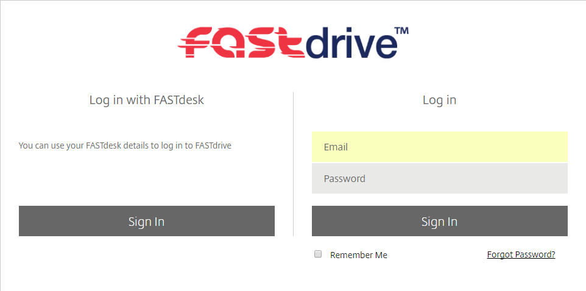
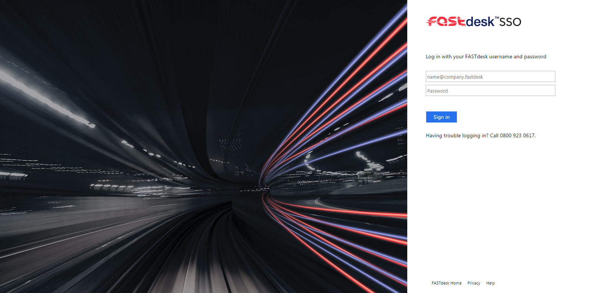
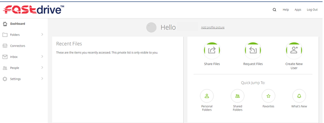
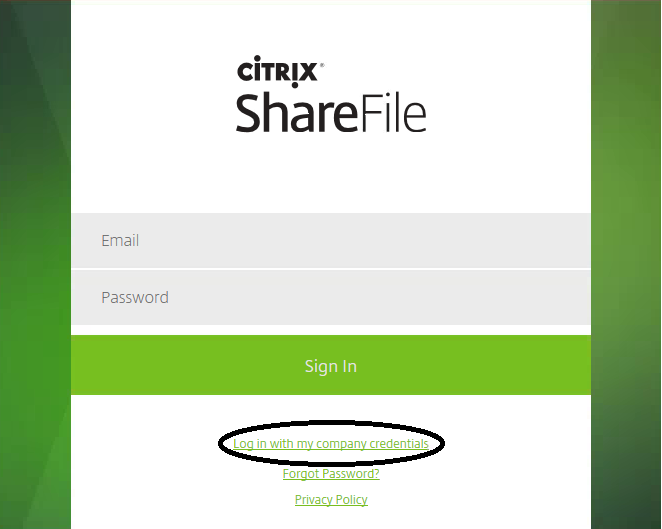
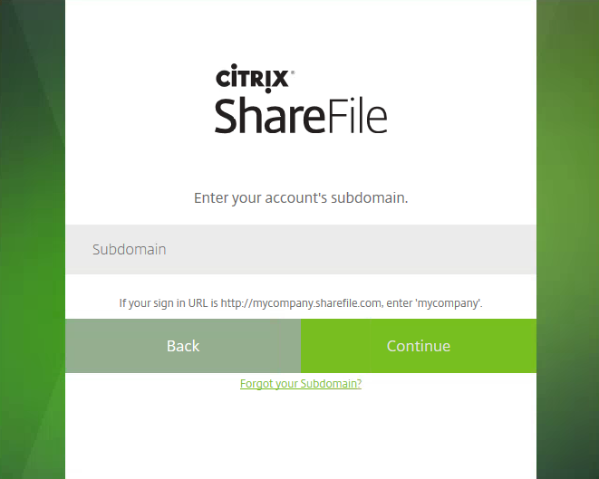
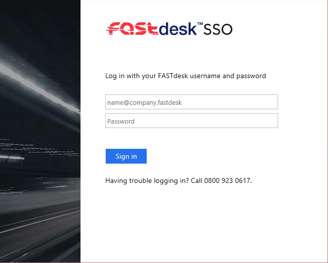
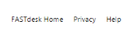
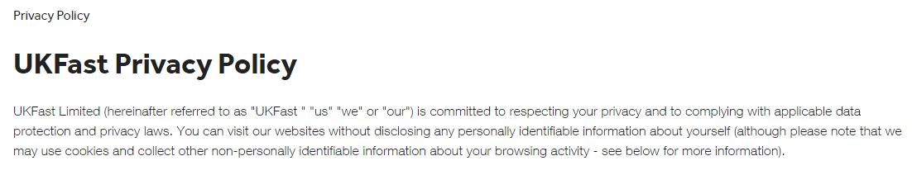
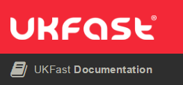

# Single Sign On

## How to activate Single Sign On

Single Sign On (SSO) can be used to make it easier to sign into your FastDrive account.

In the past, you would need to remember 2 sets of credentials for both FastDesk and FastDrive. With the use of Single Sign On, you can now sign into FastDrive using your FastDesk credentials.

## Web Application

In order to use Single Sign On, you will need to navigate to your ShareFile domain. For example, `company.sharefile.eu`. This should look something like this on the sign in page:



As you can see there are 2 options to log into FastDrive with. The login on the right hand side of the screen will be the regular way to login to FastDrive with and will use your FastDrive credentials. The left hand side is to sign in with Single Sign On. Once you click 'Sign In' on the left hand side, you will be re-directed to the following page:



Here you will need to login with your FastDesk credentials as opposed to your FastDrive credentials.

You will then be logged into your FastDrive account onto the 'Dashboard'.



## In Desktop Applications

Once you have set-up Single Sign On on the web application, you will then be able to use SSO to sign into any ShareFile desktop applications you have. When you load up the desktop application, you will be presented with the following login screen. You will need to select 'Log in with my company credentials'.



You will then be asked to enter the subdomain to your account. This will be the subdomain for the URL you use for ShareFile. For example, if you type in `mycompany.sharefile.eu`, then enter `mycompany`.



Once you have typed in the subdomain to your account, click 'Continue'.

You will then be presented with the Single Sign On login screen of which you will need to enter your FastDesk credentials.



You will now be signed in with Single Sign On for your desktop application of ShareFile.

## Extra Information

When signing into Single Sign On using the web application, you will see the following 3 options at the bottom of the page:



Selecting 'FastDesk Home' will direct you to `daas.ecloud.co.uk`. This is where you would normally sign in for FastDesk when using a browser. Entering your FastDesk credentials here will lead you to your virtual desktop.


Selecting 'Privacy' will lead to you to the Privacy Policy article on the UKFast website.



Selecting 'Help' will lead you to the UKFast documentation page, specifically this article.



```eval_rst
   .. title:: FastDrive Single Sign On
   .. meta::
      :title: FastDrive Single Sign On | ANS Documentation
      :description: Guide for using single sign-on with FastDrive
      :keywords: FastDrive, Citrix, ukfast, sso
```
