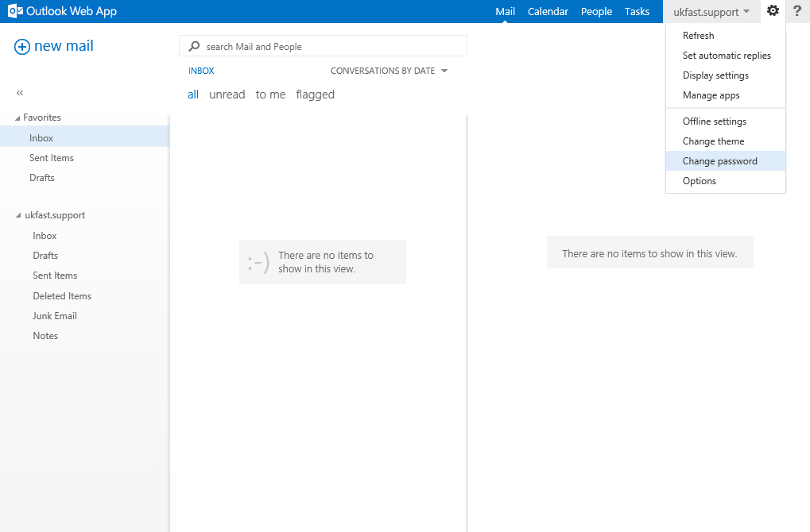

# Changing your Shared Exchange password

```eval_rst
  .. title:: Shared Exchange | Changing your password
  .. meta::
    :title: Shared Exchange | Changing your password | UKFast Documentation
    :description: Information on how to change your password in Shared Exchange    
```

To change your password, you'll first need to log into the webmail client, as described in the following article: [Connecting via Webmail](/desktop/sharedexchange/webmailconnect)

<https://client.ukfastexchange.co.uk/owa>

Once logged in, run through the following steps to change your password:

```eval_rst
.. note::
   Position of elements mentioned may vary depending on which version of the webmail client you're using
```

Click on `Settings` in the top right corner of the screen (the cog icon).
Click on `Change Password`.



Fill in the boxes on this page with your current password and your desired new password:


```eval_rst
.. warning::
   As always, strong passwords are highly recommended for your own security.

   Mailboxes are frequently targetted by blind, brute-force attacks, so any dictionary words or common substitions (`m1ch43L!`) should be avoided.

   Whilst it may be slightly harder to remember, choosing a password that is `at least 8 characters long and a mixture of upper/lower case letters and numbers` will keep you safer in the long run.
```

If you have any issues carrying out the above steps, please raise a ticket with UKFast requesting a password change and our engineers will be able to assist.
