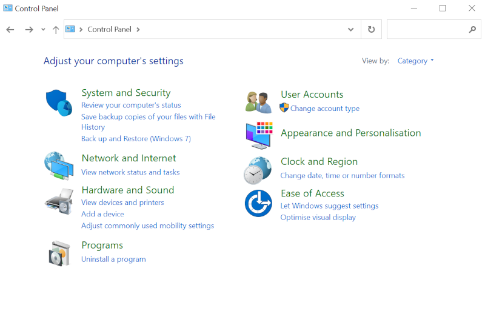
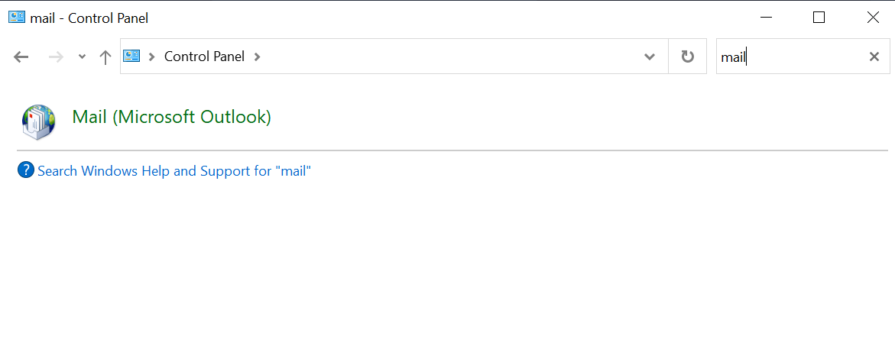
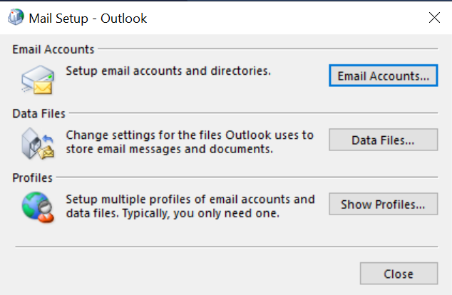
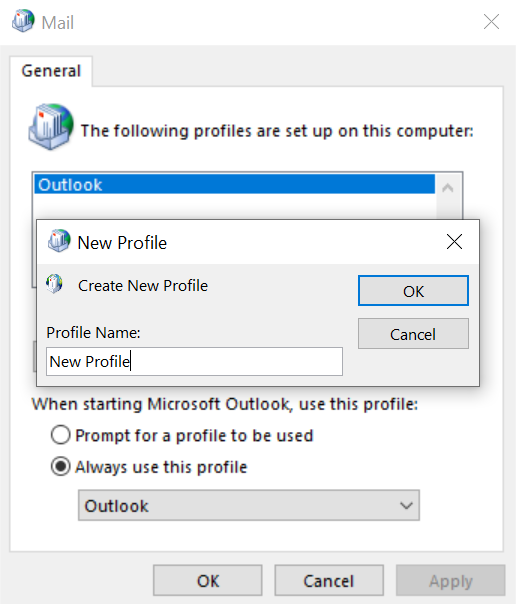
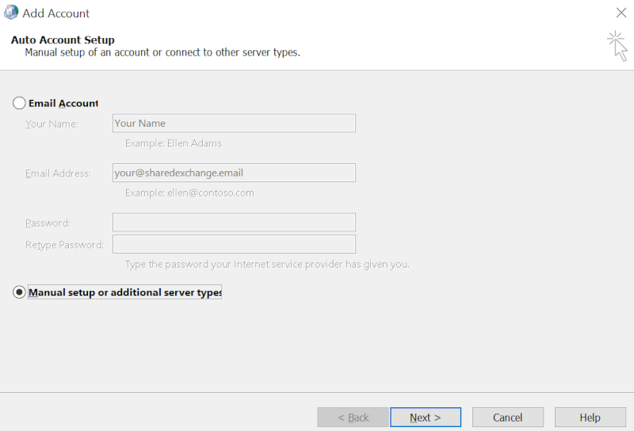

# Creating a new Outlook profile

## Introduction

In this guide we will walk you through the steps needed to add your Shared Exchange account to a fresh profile within Microsoft Outlook. You can have a new default profile or ask Outlook to let you select a profile each time it is opened.

## Creating a new Microsoft Outlook profile.

1. **Close Outlook**
    - Ensure that Microsoft Outlook is completely closed before starting the process of adding a new profile.

2. **Open Control Panel**
    - Click on the "Start" button or press the Windows key, then search for "Control Panel" and open it.

    

4. **Locate Mail (Microsoft Outlook)**
    - In the Control Panel window, search for the "Mail" or "Mail (Microsoft Outlook)" icon and click on it. 'The Mail Setup Outlook' dialog box will appear.

    

5. **Access Email Accounts**
    - In the Mail Setup dialog box, click on the "Show Profiles" button. This will open the Mail dialog box.

    

6. **Create New Profile**
    - In the Mail dialog box, click on the "Add" button to create a new Outlook profile. Enter a name for your new profile in the "Profile Name" field, then click "OK".

    

7. **Set Up Email Accounts**

    - Enter Your Email Address: In the Add Account wizard, enter your email address associated with your Microsoft Exchange account in the "Email Address" field.
    - Provide Your Password: Enter the password for your Microsoft Exchange email account in the "Password" field.
    - Automatic Configuration: Outlook will attempt to automatically configure your Exchange email account settings based on your email address and password. If successful, you'll see a green check-mark, indicating that the account setup is complete.
    - If the automatic setup doesn't work, proceed to step 7, if it is successful, go to step 8.

8. **Manual Configuration**
    - If Outlook couldn't automatically configure your Exchange account, you'll need to set it up manually.

    

    - Select the option "Manual setup or additional server types" and click "Next".
    - Choose Account Type: On the next screen, select the option "Microsoft Exchange or compatible service" and click "Next".
    - Enter Exchange Server Settings: In the Microsoft Exchange Settings section add **client.ukfastexchange.co.uk**
    - User Name: Enter your user name or email address associated with your Exchange account.
    - Use Cached Exchange Mode (Optional): If you want to store a local copy of your mailbox for offline access, check the box for "Use Cached Exchange Mode." This option is recommended for most users.
    - Check Name: Click on the "Check Name" button to validate your server and user information. If everything is entered correctly, Outlook will resolve your name and underline it.

9. **Complete the Setup**
    - Click "Next" and then "Finish" to complete the setup process. Outlook will finalise the configuration and connect to your Microsoft Exchange email account.
    
You have successfully added a new Microsoft Exchange email account to Microsoft Outlook. The account will now be listed in the Account Settings window, and you'll be able to access your Exchange mailbox and manage your emails, calendar, and contacts within Outlook.

If you encounter any issues setting up your new profile and would like assistance, please let us know by contacting support. You can do this through your [ANS Portal](https://portal.ans.co.uk/login?url=dashboard&msg=6) under support > priority support system.
You can also contact support via telephone on 0800 230 0032.

```eval_rst
  .. title:: Mail | Creating a new Outlook profile for Shared Exchange
  .. meta::
     :title: Creating a new Outlook profile for Shared Exchange | UKFast Documentation
     :description: How to create a new Outlook profile
     :keywords: shared exchange, profile, howto, guide, tutorial, outlook
```
