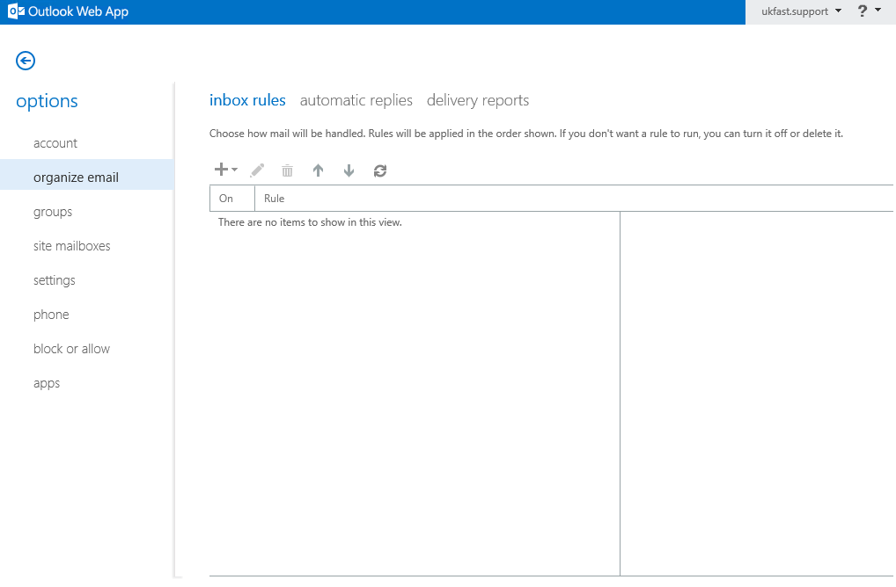
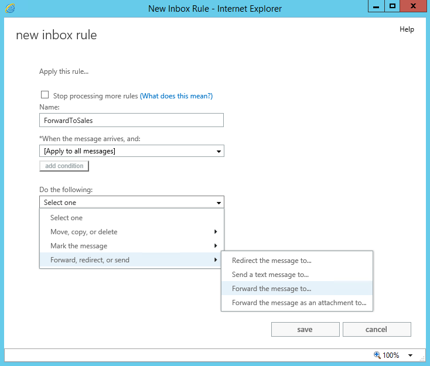
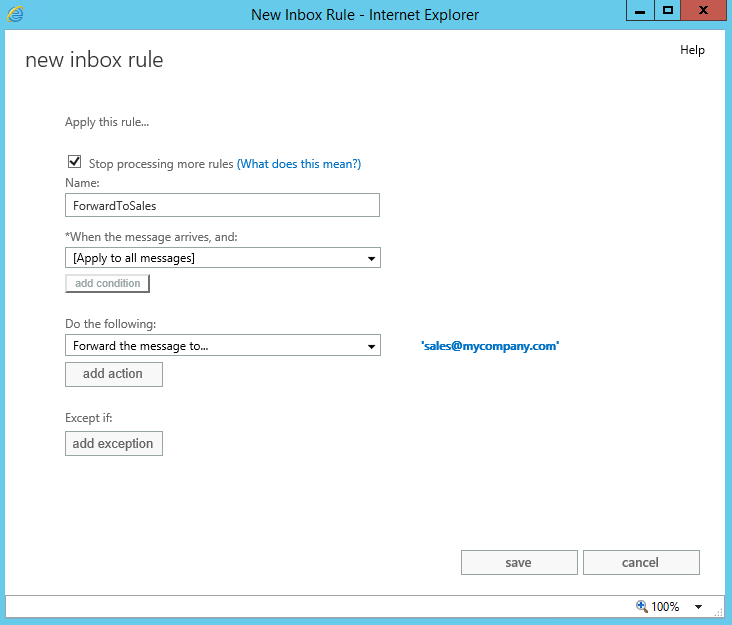

# Configuring Automatic Forwarding Rules

```eval_rst
   .. meta::
      :title: Shared Exchange | Forwarding Rules | UKFast Documentation
      :description: Information on how to Configuring Automatic Forwarding Rules in Shared Exchange
      
```

On the shared exchange platform, email forwarders are configured using the webmail client.

As such, you'll first need to log into the webmail area, as described in the following article: [Connecting via Webmail](/desktop/sharedexchange/webmailconnect.html) via this link <https://client.ukfastexchange.co.uk/owa>

In the top right hand corner, select `Settings` and then `Options`


Select `organize email` from the left hand menu




Select the plus icon and then `Create a new rule for arriving messages..`


Give the new rule a name under the heading `*When the message arrives, and:` select `[Apply to all messages]`


Select `More options...`


Under `Do the following:` select `Forward, redirect, or send` and then `Forward the message to...`




In the `To` field, type the email address of the recipient that you wish to forward the messages to and select `OK`


Check over the rule and select `save`




You should now see the new rule set up.
To edit the rule, use the pencil icon.


If you have any issues with getting this working, just drop a ticket into UKFast support and our engineers will be able to offer some help.
