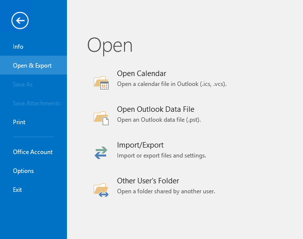
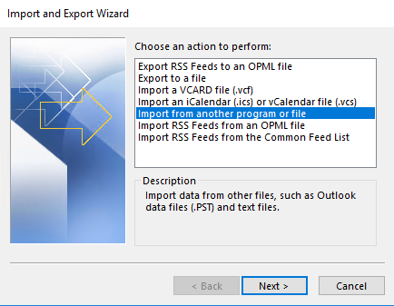
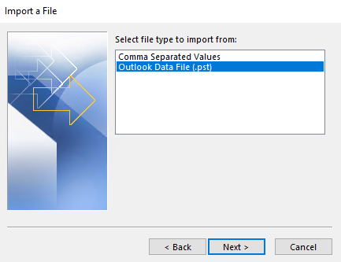
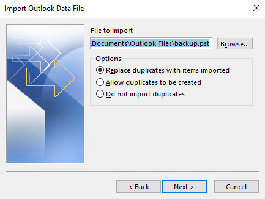
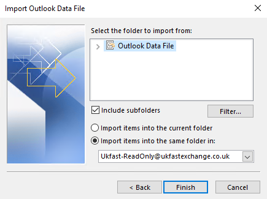

# How to import data from a .pst backup

## Introduction

In this guide, you will learn how to restore email data previously backed up in the .pst format.

## Prerequisites

Before you begin, ensure you have the following:

1. An email client that supports importing mailbox data from .pst format.
2. A local machine or storage device with sufficient storage capacity for the restore.


## Import data from pst into Microsoft Outlook

1. ### Launch Outlook

Open the Outlook application on your computer. Make sure you're logged in with the email account where you want to import the data.


2. ### Open Import/Export



In the "File" tab, click on "Open & Export" or "Open" (depending on your Outlook version). Then, select "Import/Export" from the options.


3. ### Choose Import from Another Program or File



In the Import and Export Wizard window that appears, select the option "Import from another program or file" and click "Next."


4. ### Select File Type



On the next screen, choose "Outlook Data File (.pst)" and click "Next."


5. ### Locate the .pst File



Click on the "Browse" button to navigate to the location where your .pst file is stored. Select the file and click "Open."


6. ### Choose Import Options



In the Import Outlook Data File window, you have several options for importing the data. Here are the most common ones:

    1. Import items into the current folder: This option will import the data directly into your existing folders in Outlook.

    2. Import items into the same folder in: Choose this option if you want to create a separate folder to import the data into. Click the "Browse" button to select the destination folder.

    3. Replace duplicates with items imported: If you have duplicate items between the .pst file and your Outlook account, selecting this option will replace the existing items with the imported ones.

    4. Do not import duplicates: This option skips importing any items that already exist in your Outlook account.
    
    5. Select the desired import options and click "Next."


7. ### Choose import target

On the final screen, choose the option "Import items into the current folder" or "Import items into the same folder in" (depending on your selection in step 6). You can also check the box next to "Include subfolders" if you want to import data from subfolders within the .pst file.


8. ### Finishing Up

Click "Finish" to start the import process. Outlook will begin importing the data from the .pst file into your account.

Monitor Import Progress: Depending on the size of the .pst file and the amount of data being imported, the process may take some time. You can monitor the progress in the Outlook status bar. Once the import is complete, you'll see a notification indicating that the process finished successfully. Click "OK" to close the notification.

Congratulations! You have successfully imported data from a .pst file into Outlook. The imported items should now be available in your Outlook account.

```eval_rst
  .. title:: Mail | How to import data from a .pst file
  .. meta::
     :title: How to import data from a .pst backup | UKFast Documentation
     :description: How to import data which has previously been backed up to a pst file.
     :keywords: shared exchange, pst, backup, back up, restore, howto, guide, tutorial, outlook
```
