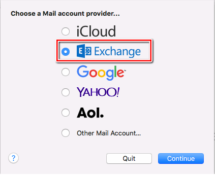
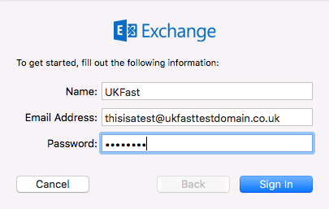
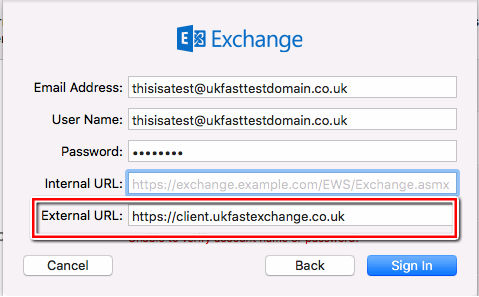
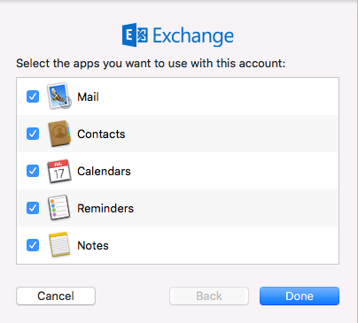
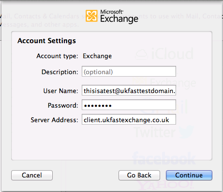

# How to Connect to Your Shared Exchange Mailbox Using the Mail app for Mac

```eval_rst
  .. title:: Shared Exchange | Connect using Mac Mail
   .. meta::
      :title: Shared Exchange | Connect using Mac Mail | UKFast Documentation
      :description: Information on How to Connect to Your Shared Exchange Mailbox Using the Mail app for Mac
      
```

The easiest way to configure any email client is to correctly configure the autodiscover DNS record. With autodiscover configured, takes away the inconvenience of being required to know all of the mail server settings all that is needed is the username and password, the rest is automatic. To configure autodiscover, please review our guide on Shared Exchange DNS Setup.

If you have not configured an autodiscover record and would like to setup your account manually please follow the instructions below:

## For The Mail app on OS X 10.9 (Mavericks), 10.10 (Yosemite), 10.11 (El Capitan) and 10.12 (Sierra)

Open system preferences and select Internet Accounts followed by Exchange account from the available options (see below):


 

 Give the account a name, and fill out your email address and password. The password has been set on your welcome email. If you do not know what this is, you can reset it by following the instructions [here](/desktop/sharedexchange/changepassword)

 

 In the next window, enter your username, which is your email address.
   Enter the external URL "https://client.ukfastexchange.co.uk"

 

 Leave all of the items you'd like to synchronize checked

 

 Your account is now ready to use.

## For The Mail app on OS X 10.8 (Mountain Lion) or older

 Open system preferences and select Mail, Contacts & Calendars followed by Microsoft Exchange

 

 Fill out your name, email address and password

 

 Enter a description for the account, your username is the email
   address you have been provided with. The server address is
   "client.ukfastexchange.co.uk"

 )

 Select continue on the account summary window

 

 Leave all of the items you'd like to synchronize checked


